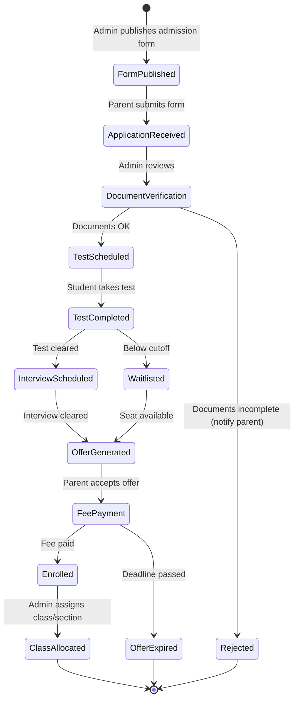
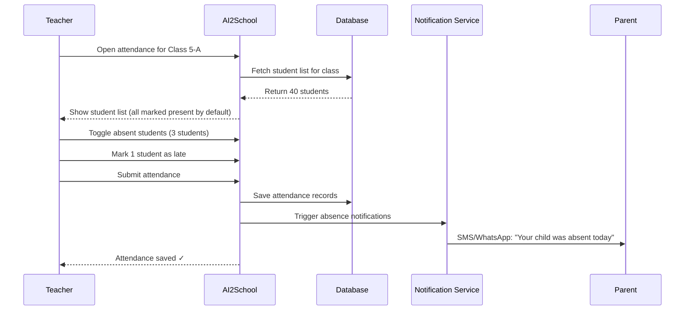
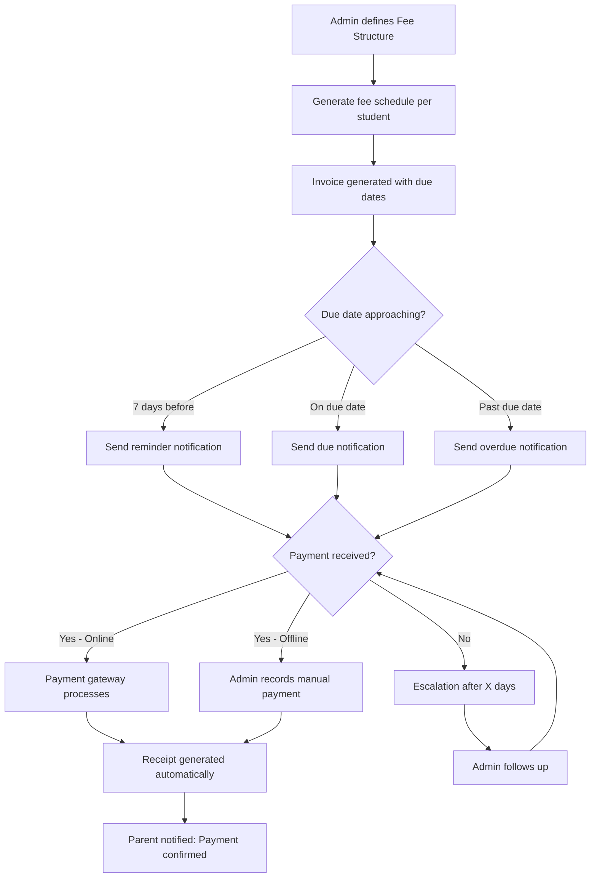
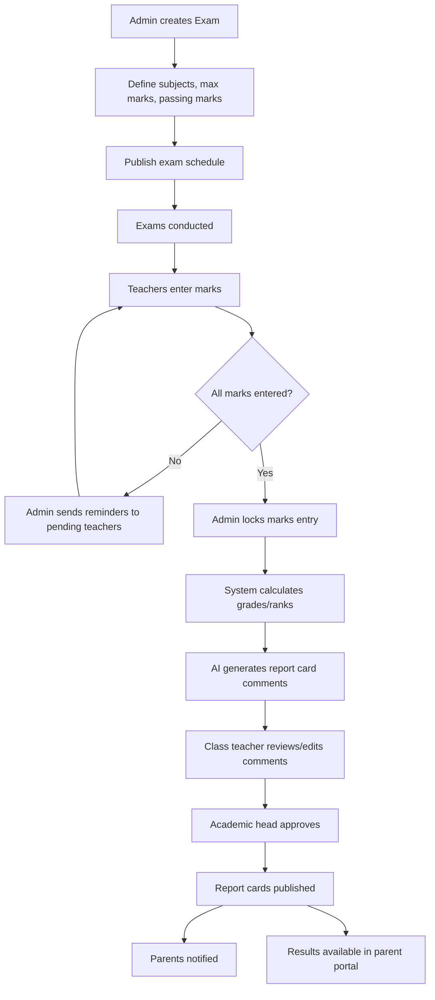
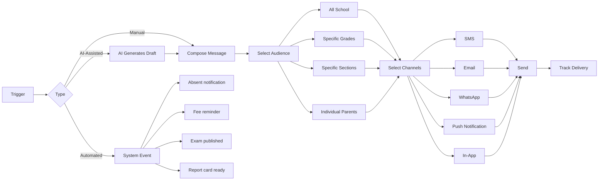

# Module 1: School ERP — Complete Design

---

## 1.1 Student Information System (SIS)

### 1.1.1 Admissions

#### User Stories

| ID | As a... | I want to... | So that... | Priority |
|---|---|---|---|---|
| SIS-001 | Admin | create an online admission form with configurable fields | parents can apply online | P0 |
| SIS-002 | Parent | fill the admission form online and upload documents | I don't need to visit the school multiple times | P0 |
| SIS-003 | Admin | track admission applications through stages (Applied → Reviewed → Test Scheduled → Interviewed → Offered → Accepted → Enrolled) | I can manage the admission pipeline | P0 |
| SIS-004 | Admin | configure admission criteria and required documents per grade | the admission process is standardized | P0 |
| SIS-005 | Principal | view admission analytics (applications per grade, conversion rates, source analysis) | I can plan capacity and marketing | P1 |
| SIS-006 | Admin | send admission status updates via email/SMS/WhatsApp | parents stay informed | P0 |
| SIS-007 | Admin | generate admission number automatically upon enrollment | records are consistent | P0 |
| SIS-008 | Admin | configure admission fees and collect payment online | fee collection is seamless | P1 |
| SIS-009 | Multi-School Director | view admission numbers across all campuses | I can benchmark and allocate resources | P2 |

#### Admission Workflow



#### Screens

1. **Admission Dashboard** (Admin)
   - Pipeline view (Kanban-style) showing applications in each stage
   - Filters: Grade, Date Range, Status, Source
   - Quick actions: Move to next stage, Send notification, View profile
   - Stats bar: Total applications, Conversion rate, Pending reviews

2. **Admission Form Builder** (Admin)
   - Drag-and-drop form builder
   - Field types: Text, Number, Date, Dropdown, File Upload, Checkbox
   - Conditional fields (e.g., show "Previous School" only for Class 2+)
   - Required document checklist configuration
   - Preview mode

3. **Online Application Form** (Parent)
   - Multi-step form with progress indicator
   - Student details, Parent details, Previous school, Documents, Declaration
   - Document upload with file type/size validation
   - Save draft and continue later
   - Application tracking page with status timeline

4. **Application Review** (Admin)
   - Full application view with document preview
   - Checklist for verification
   - Notes/comments section
   - Action buttons: Approve, Reject, Request More Info, Schedule Test
   - Communication log

#### API Endpoints

```
POST   /api/v1/admissions/forms                    # Create admission form template
GET    /api/v1/admissions/forms/{formId}            # Get form template
PUT    /api/v1/admissions/forms/{formId}            # Update form template
POST   /api/v1/admissions/forms/{formId}/publish    # Publish form

POST   /api/v1/admissions/applications              # Submit application
GET    /api/v1/admissions/applications               # List applications (filtered)
GET    /api/v1/admissions/applications/{appId}       # Get application details
PUT    /api/v1/admissions/applications/{appId}/status # Update application status
POST   /api/v1/admissions/applications/{appId}/notes  # Add note to application

POST   /api/v1/admissions/applications/{appId}/documents  # Upload document
GET    /api/v1/admissions/applications/{appId}/documents  # List documents

GET    /api/v1/admissions/analytics                  # Admission analytics
GET    /api/v1/admissions/pipeline                   # Pipeline summary

POST   /api/v1/admissions/applications/{appId}/enroll  # Enroll student (creates student record)
```

#### Database Tables

```sql
-- Admission Form Templates
CREATE TABLE admission_forms (
    id UUID PRIMARY KEY DEFAULT gen_random_uuid(),
    school_id UUID NOT NULL REFERENCES schools(id),
    academic_year_id UUID NOT NULL REFERENCES academic_years(id),
    name VARCHAR(255) NOT NULL,
    grade_ids UUID[] NOT NULL,  -- Applicable grades
    form_schema JSONB NOT NULL,  -- Dynamic form field definitions
    required_documents JSONB NOT NULL,  -- [{type: 'birth_certificate', label: '...', required: true}]
    admission_fee DECIMAL(10,2),
    status VARCHAR(20) DEFAULT 'draft',  -- draft, published, closed
    published_at TIMESTAMP,
    deadline_at TIMESTAMP,
    created_at TIMESTAMP DEFAULT NOW(),
    updated_at TIMESTAMP DEFAULT NOW(),
    created_by UUID REFERENCES users(id)
);

-- Admission Applications
CREATE TABLE admission_applications (
    id UUID PRIMARY KEY DEFAULT gen_random_uuid(),
    school_id UUID NOT NULL REFERENCES schools(id),
    form_id UUID NOT NULL REFERENCES admission_forms(id),
    application_number VARCHAR(50) UNIQUE NOT NULL,
    student_data JSONB NOT NULL,  -- Name, DOB, gender, etc.
    parent_data JSONB NOT NULL,   -- Father, Mother, Guardian details
    previous_school_data JSONB,
    additional_data JSONB,        -- Dynamic form field responses
    status VARCHAR(30) DEFAULT 'submitted',
    -- submitted, under_review, test_scheduled, test_completed,
    -- interview_scheduled, offered, accepted, fee_paid, enrolled,
    -- waitlisted, rejected, withdrawn
    applied_for_grade_id UUID REFERENCES grades(id),
    source VARCHAR(50),           -- website, referral, walk_in, campaign
    assigned_to UUID REFERENCES users(id),
    admission_number VARCHAR(50), -- Generated on enrollment
    enrolled_at TIMESTAMP,
    created_at TIMESTAMP DEFAULT NOW(),
    updated_at TIMESTAMP DEFAULT NOW()
);

-- Application Status History
CREATE TABLE admission_status_history (
    id UUID PRIMARY KEY DEFAULT gen_random_uuid(),
    application_id UUID NOT NULL REFERENCES admission_applications(id),
    from_status VARCHAR(30),
    to_status VARCHAR(30) NOT NULL,
    changed_by UUID REFERENCES users(id),
    notes TEXT,
    created_at TIMESTAMP DEFAULT NOW()
);

-- Application Documents
CREATE TABLE admission_documents (
    id UUID PRIMARY KEY DEFAULT gen_random_uuid(),
    application_id UUID NOT NULL REFERENCES admission_applications(id),
    document_type VARCHAR(50) NOT NULL,
    file_name VARCHAR(255) NOT NULL,
    file_path TEXT NOT NULL,
    file_size INTEGER,
    mime_type VARCHAR(100),
    verified BOOLEAN DEFAULT FALSE,
    verified_by UUID REFERENCES users(id),
    verified_at TIMESTAMP,
    created_at TIMESTAMP DEFAULT NOW()
);

-- Application Notes
CREATE TABLE admission_notes (
    id UUID PRIMARY KEY DEFAULT gen_random_uuid(),
    application_id UUID NOT NULL REFERENCES admission_applications(id),
    note TEXT NOT NULL,
    created_by UUID REFERENCES users(id),
    created_at TIMESTAMP DEFAULT NOW()
);
```

---

### 1.1.2 Student Profiles

#### User Stories

| ID | As a... | I want to... | So that... | Priority |
|---|---|---|---|---|
| SIS-010 | Admin | maintain comprehensive student profiles with personal, academic, and health info | we have a single source of truth | P0 |
| SIS-011 | Teacher | view student profiles for my class students | I can understand each student | P0 |
| SIS-012 | Parent | view and update my child's profile information | records stay current | P1 |
| SIS-013 | Admin | bulk import students from Excel/CSV | onboarding existing schools is fast | P0 |
| SIS-014 | Admin | search students globally by name, admission no, class, or parent phone | I can find any student quickly | P0 |

#### Database Tables

```sql
-- Core Student Record
CREATE TABLE students (
    id UUID PRIMARY KEY DEFAULT gen_random_uuid(),
    school_id UUID NOT NULL REFERENCES schools(id),
    admission_number VARCHAR(50) NOT NULL,
    first_name VARCHAR(100) NOT NULL,
    middle_name VARCHAR(100),
    last_name VARCHAR(100) NOT NULL,
    date_of_birth DATE NOT NULL,
    gender VARCHAR(10) NOT NULL,
    blood_group VARCHAR(5),
    nationality VARCHAR(50) DEFAULT 'Indian',
    religion VARCHAR(50),
    caste_category VARCHAR(20), -- General, OBC, SC, ST
    aadhaar_number VARCHAR(12),
    mother_tongue VARCHAR(50),
    photo_url TEXT,
    
    -- Current Academic Info
    current_grade_id UUID REFERENCES grades(id),
    current_section_id UUID REFERENCES sections(id),
    current_academic_year_id UUID REFERENCES academic_years(id),
    roll_number INTEGER,
    
    -- Contact
    address_line1 TEXT,
    address_line2 TEXT,
    city VARCHAR(100),
    state VARCHAR(100),
    pincode VARCHAR(10),
    
    -- Medical
    medical_conditions JSONB,  -- [{condition: '...', details: '...'}]
    allergies TEXT,
    emergency_contact_name VARCHAR(200),
    emergency_contact_phone VARCHAR(15),
    
    -- Status
    status VARCHAR(20) DEFAULT 'active', -- active, inactive, transferred, graduated, dropped
    admission_date DATE,
    leaving_date DATE,
    leaving_reason TEXT,
    
    -- Metadata
    created_at TIMESTAMP DEFAULT NOW(),
    updated_at TIMESTAMP DEFAULT NOW(),
    
    UNIQUE(school_id, admission_number)
);

CREATE INDEX idx_students_school_grade ON students(school_id, current_grade_id);
CREATE INDEX idx_students_school_section ON students(school_id, current_section_id);
CREATE INDEX idx_students_name ON students(school_id, first_name, last_name);

-- Parent/Guardian Records
CREATE TABLE parents (
    id UUID PRIMARY KEY DEFAULT gen_random_uuid(),
    school_id UUID NOT NULL REFERENCES schools(id),
    user_id UUID REFERENCES users(id), -- Linked user account
    relation_type VARCHAR(20) NOT NULL, -- father, mother, guardian
    first_name VARCHAR(100) NOT NULL,
    last_name VARCHAR(100) NOT NULL,
    email VARCHAR(255),
    phone VARCHAR(15) NOT NULL,
    alt_phone VARCHAR(15),
    occupation VARCHAR(100),
    organization VARCHAR(200),
    qualification VARCHAR(100),
    annual_income VARCHAR(50),
    aadhaar_number VARCHAR(12),
    photo_url TEXT,
    address_line1 TEXT,
    city VARCHAR(100),
    state VARCHAR(100),
    pincode VARCHAR(10),
    created_at TIMESTAMP DEFAULT NOW(),
    updated_at TIMESTAMP DEFAULT NOW()
);

-- Student-Parent Relationship
CREATE TABLE student_parents (
    student_id UUID REFERENCES students(id),
    parent_id UUID REFERENCES parents(id),
    is_primary_contact BOOLEAN DEFAULT FALSE,
    PRIMARY KEY (student_id, parent_id)
);

-- Student Documents
CREATE TABLE student_documents (
    id UUID PRIMARY KEY DEFAULT gen_random_uuid(),
    student_id UUID NOT NULL REFERENCES students(id),
    document_type VARCHAR(50) NOT NULL,
    -- birth_certificate, transfer_certificate, report_card, 
    -- aadhaar, passport, medical_certificate, etc.
    document_name VARCHAR(255) NOT NULL,
    file_path TEXT NOT NULL,
    file_size INTEGER,
    mime_type VARCHAR(100),
    uploaded_by UUID REFERENCES users(id),
    verified BOOLEAN DEFAULT FALSE,
    created_at TIMESTAMP DEFAULT NOW()
);

-- Academic History
CREATE TABLE student_academic_history (
    id UUID PRIMARY KEY DEFAULT gen_random_uuid(),
    student_id UUID NOT NULL REFERENCES students(id),
    academic_year_id UUID NOT NULL REFERENCES academic_years(id),
    grade_id UUID NOT NULL REFERENCES grades(id),
    section_id UUID REFERENCES sections(id),
    roll_number INTEGER,
    result VARCHAR(20), -- promoted, detained, transferred
    overall_percentage DECIMAL(5,2),
    overall_grade VARCHAR(5),
    remarks TEXT,
    created_at TIMESTAMP DEFAULT NOW()
);

-- Promotion Workflows
CREATE TABLE promotions (
    id UUID PRIMARY KEY DEFAULT gen_random_uuid(),
    school_id UUID NOT NULL REFERENCES schools(id),
    from_academic_year_id UUID NOT NULL,
    to_academic_year_id UUID NOT NULL,
    from_grade_id UUID NOT NULL,
    to_grade_id UUID NOT NULL,
    status VARCHAR(20) DEFAULT 'pending', -- pending, in_progress, completed
    promoted_count INTEGER DEFAULT 0,
    detained_count INTEGER DEFAULT 0,
    initiated_by UUID REFERENCES users(id),
    approved_by UUID REFERENCES users(id),
    created_at TIMESTAMP DEFAULT NOW(),
    completed_at TIMESTAMP
);

-- Transfer Certificates
CREATE TABLE transfer_certificates (
    id UUID PRIMARY KEY DEFAULT gen_random_uuid(),
    student_id UUID NOT NULL REFERENCES students(id),
    tc_number VARCHAR(50) UNIQUE NOT NULL,
    reason VARCHAR(100), -- transfer, leaving_city, other
    last_class_attended VARCHAR(20),
    last_exam_appeared VARCHAR(100),
    result VARCHAR(50),
    conduct VARCHAR(100),
    date_of_issue DATE,
    issued_by UUID REFERENCES users(id),
    template_data JSONB, -- All fields for TC template
    pdf_path TEXT,
    created_at TIMESTAMP DEFAULT NOW()
);
```

---

## 1.2 Attendance Management

### User Stories

| ID | As a... | I want to... | So that... | Priority |
|---|---|---|---|---|
| ATT-001 | Teacher | mark daily attendance for my class in under 2 minutes | I don't waste teaching time | P0 |
| ATT-002 | Teacher | mark period-wise attendance | subject-level attendance is tracked | P1 |
| ATT-003 | Admin | view attendance reports by class, date range, student | I can identify patterns | P0 |
| ATT-004 | Parent | receive notification when my child is absent | I'm immediately aware | P0 |
| ATT-005 | Admin | integrate biometric/RFID attendance data | attendance is automated | P2 |
| ATT-006 | Teacher | view attendance trends for my class | I can identify frequently absent students | P1 |
| ATT-007 | Principal | view school-wide attendance dashboard | I can monitor attendance health | P1 |
| ATT-008 | Admin | mark teacher attendance | staff attendance is tracked | P0 |
| ATT-009 | Parent | apply for leave on behalf of my child | leave tracking is digital | P1 |
| ATT-010 | Teacher | mark late arrivals separately from absences | punctuality is tracked | P1 |

### Attendance Marking Workflow



### Screens

1. **Daily Attendance** (Teacher)
   - Class/Section selector (auto-defaults to assigned class)
   - Date selector (defaults to today)
   - Student list with photo thumbnails
   - Quick toggle: Present (green) / Absent (red) / Late (yellow) / Half-day (orange)
   - "Select All Present" button (most common action)
   - Bulk absent marking
   - Notes field per student
   - Submit with confirmation

2. **Attendance Report** (Admin/Principal)
   - Filters: Class, Section, Date Range, Student
   - Summary cards: Overall %, Chronic absentees, Perfect attendance
   - Heatmap view: Days × Students
   - Trend chart: Attendance % over time
   - Export to Excel/PDF

3. **Student Attendance View** (Parent)
   - Calendar view with color-coded days
   - Monthly/Term attendance percentage
   - Leave application form

### API Endpoints

```
POST   /api/v1/attendance/students            # Mark/update student attendance (bulk)
GET    /api/v1/attendance/students             # Get attendance (filtered by class, date, student)
GET    /api/v1/attendance/students/{studentId} # Get student's attendance history

POST   /api/v1/attendance/teachers             # Mark teacher attendance
GET    /api/v1/attendance/teachers             # Get teacher attendance

GET    /api/v1/attendance/reports/class/{classId}     # Class attendance report
GET    /api/v1/attendance/reports/school              # School-wide attendance report
GET    /api/v1/attendance/reports/trends              # Attendance trends

POST   /api/v1/attendance/leave-requests       # Student leave application
PUT    /api/v1/attendance/leave-requests/{id}/approve  # Approve leave
PUT    /api/v1/attendance/leave-requests/{id}/reject   # Reject leave
```

### Database Tables

```sql
-- Daily Student Attendance
CREATE TABLE student_attendance (
    id UUID PRIMARY KEY DEFAULT gen_random_uuid(),
    school_id UUID NOT NULL REFERENCES schools(id),
    student_id UUID NOT NULL REFERENCES students(id),
    academic_year_id UUID NOT NULL REFERENCES academic_years(id),
    date DATE NOT NULL,
    status VARCHAR(15) NOT NULL, -- present, absent, late, half_day, holiday, excused
    period_number INTEGER, -- NULL for daily, 1-8 for period-wise
    marked_by UUID REFERENCES users(id),
    notes TEXT,
    source VARCHAR(20) DEFAULT 'manual', -- manual, biometric, rfid
    created_at TIMESTAMP DEFAULT NOW(),
    updated_at TIMESTAMP DEFAULT NOW(),
    
    UNIQUE(school_id, student_id, date, period_number)
);

CREATE INDEX idx_student_attendance_date ON student_attendance(school_id, date);
CREATE INDEX idx_student_attendance_student ON student_attendance(student_id, date);

-- Teacher Attendance
CREATE TABLE teacher_attendance (
    id UUID PRIMARY KEY DEFAULT gen_random_uuid(),
    school_id UUID NOT NULL REFERENCES schools(id),
    teacher_id UUID NOT NULL REFERENCES staff(id),
    date DATE NOT NULL,
    status VARCHAR(15) NOT NULL, -- present, absent, late, half_day, on_leave
    check_in_time TIME,
    check_out_time TIME,
    source VARCHAR(20) DEFAULT 'manual',
    created_at TIMESTAMP DEFAULT NOW(),
    
    UNIQUE(school_id, teacher_id, date)
);

-- Student Leave Requests
CREATE TABLE student_leave_requests (
    id UUID PRIMARY KEY DEFAULT gen_random_uuid(),
    student_id UUID NOT NULL REFERENCES students(id),
    from_date DATE NOT NULL,
    to_date DATE NOT NULL,
    reason TEXT NOT NULL,
    leave_type VARCHAR(30), -- sick, family, personal
    status VARCHAR(20) DEFAULT 'pending', -- pending, approved, rejected
    applied_by UUID REFERENCES users(id), -- Parent user
    approved_by UUID REFERENCES users(id),
    created_at TIMESTAMP DEFAULT NOW()
);
```

---

## 1.3 Fee Management

### User Stories

| ID | As a... | I want to... | So that... | Priority |
|---|---|---|---|---|
| FEE-001 | Admin | define fee structures per grade with multiple heads (tuition, transport, lab, etc.) | fees are organized | P0 |
| FEE-002 | Admin | generate fee invoices for all students automatically | manual work is eliminated | P0 |
| FEE-003 | Parent | pay fees online via UPI/Card/Net Banking | payment is convenient | P0 |
| FEE-004 | Admin | track pending fees with automatic reminders | collection improves | P0 |
| FEE-005 | Admin | apply discounts/scholarships/sibling concessions | special cases are handled | P1 |
| FEE-006 | Admin | generate fee receipts automatically | records are maintained | P0 |
| FEE-007 | Admin | view financial reports (collected, pending, overdue) | financial health is clear | P0 |
| FEE-008 | Parent | view fee history and download receipts | I have financial records | P1 |
| FEE-009 | Principal | view fee collection dashboard | I can monitor financial health | P1 |
| FEE-010 | Admin | handle refunds for students who leave mid-term | refund process is systematic | P2 |

### Fee Collection Workflow



### Database Tables

```sql
-- Fee Structure Definition
CREATE TABLE fee_structures (
    id UUID PRIMARY KEY DEFAULT gen_random_uuid(),
    school_id UUID NOT NULL REFERENCES schools(id),
    academic_year_id UUID NOT NULL REFERENCES academic_years(id),
    name VARCHAR(255) NOT NULL,
    grade_id UUID REFERENCES grades(id), -- NULL = all grades
    status VARCHAR(20) DEFAULT 'active',
    created_at TIMESTAMP DEFAULT NOW(),
    updated_at TIMESTAMP DEFAULT NOW()
);

-- Fee Heads (Tuition, Transport, Lab, etc.)
CREATE TABLE fee_heads (
    id UUID PRIMARY KEY DEFAULT gen_random_uuid(),
    school_id UUID NOT NULL REFERENCES schools(id),
    name VARCHAR(100) NOT NULL, -- Tuition Fee, Transport Fee, Lab Fee
    code VARCHAR(20) NOT NULL,
    is_mandatory BOOLEAN DEFAULT TRUE,
    is_recurring BOOLEAN DEFAULT TRUE,
    created_at TIMESTAMP DEFAULT NOW()
);

-- Fee Structure Items (which heads, how much, when)
CREATE TABLE fee_structure_items (
    id UUID PRIMARY KEY DEFAULT gen_random_uuid(),
    fee_structure_id UUID NOT NULL REFERENCES fee_structures(id),
    fee_head_id UUID NOT NULL REFERENCES fee_heads(id),
    amount DECIMAL(10,2) NOT NULL,
    frequency VARCHAR(20) NOT NULL, -- monthly, quarterly, semi_annual, annual, one_time
    due_day INTEGER, -- Day of month for recurring
    tax_percentage DECIMAL(4,2) DEFAULT 0,
    created_at TIMESTAMP DEFAULT NOW()
);

-- Student Fee Invoices
CREATE TABLE fee_invoices (
    id UUID PRIMARY KEY DEFAULT gen_random_uuid(),
    school_id UUID NOT NULL REFERENCES schools(id),
    student_id UUID NOT NULL REFERENCES students(id),
    invoice_number VARCHAR(50) UNIQUE NOT NULL,
    academic_year_id UUID NOT NULL REFERENCES academic_years(id),
    period_label VARCHAR(50), -- "April 2025", "Q1 2025", etc.
    total_amount DECIMAL(10,2) NOT NULL,
    discount_amount DECIMAL(10,2) DEFAULT 0,
    tax_amount DECIMAL(10,2) DEFAULT 0,
    net_amount DECIMAL(10,2) NOT NULL,
    paid_amount DECIMAL(10,2) DEFAULT 0,
    status VARCHAR(20) DEFAULT 'pending', -- pending, partially_paid, paid, overdue, cancelled
    due_date DATE NOT NULL,
    created_at TIMESTAMP DEFAULT NOW(),
    updated_at TIMESTAMP DEFAULT NOW()
);

-- Invoice Line Items
CREATE TABLE fee_invoice_items (
    id UUID PRIMARY KEY DEFAULT gen_random_uuid(),
    invoice_id UUID NOT NULL REFERENCES fee_invoices(id),
    fee_head_id UUID NOT NULL REFERENCES fee_heads(id),
    amount DECIMAL(10,2) NOT NULL,
    discount DECIMAL(10,2) DEFAULT 0,
    tax DECIMAL(10,2) DEFAULT 0,
    net_amount DECIMAL(10,2) NOT NULL
);

-- Fee Payments
CREATE TABLE fee_payments (
    id UUID PRIMARY KEY DEFAULT gen_random_uuid(),
    school_id UUID NOT NULL REFERENCES schools(id),
    invoice_id UUID NOT NULL REFERENCES fee_invoices(id),
    student_id UUID NOT NULL REFERENCES students(id),
    amount DECIMAL(10,2) NOT NULL,
    payment_mode VARCHAR(20) NOT NULL, -- online, cash, cheque, dd, bank_transfer
    payment_gateway VARCHAR(50), -- razorpay, paytm, etc.
    transaction_id VARCHAR(100),
    gateway_response JSONB,
    receipt_number VARCHAR(50) UNIQUE NOT NULL,
    payment_date DATE NOT NULL,
    collected_by UUID REFERENCES users(id),
    status VARCHAR(20) DEFAULT 'success', -- success, failed, refunded
    created_at TIMESTAMP DEFAULT NOW()
);

-- Fee Discounts / Concessions
CREATE TABLE fee_discounts (
    id UUID PRIMARY KEY DEFAULT gen_random_uuid(),
    school_id UUID NOT NULL REFERENCES schools(id),
    student_id UUID NOT NULL REFERENCES students(id),
    fee_head_id UUID REFERENCES fee_heads(id), -- NULL = all heads
    discount_type VARCHAR(20) NOT NULL, -- percentage, fixed
    discount_value DECIMAL(10,2) NOT NULL,
    reason VARCHAR(100), -- sibling, scholarship, staff_child, merit
    academic_year_id UUID NOT NULL REFERENCES academic_years(id),
    approved_by UUID REFERENCES users(id),
    created_at TIMESTAMP DEFAULT NOW()
);

-- Fee Reminders Log
CREATE TABLE fee_reminders (
    id UUID PRIMARY KEY DEFAULT gen_random_uuid(),
    invoice_id UUID NOT NULL REFERENCES fee_invoices(id),
    student_id UUID NOT NULL REFERENCES students(id),
    reminder_type VARCHAR(20), -- upcoming, due, overdue
    channel VARCHAR(20), -- sms, email, whatsapp, push
    sent_at TIMESTAMP DEFAULT NOW(),
    status VARCHAR(20) DEFAULT 'sent' -- sent, delivered, failed
);
```

---

## 1.4 Timetable Management

### User Stories

| ID | As a... | I want to... | So that... | Priority |
|---|---|---|---|---|
| TT-001 | Admin | create class timetables with period/subject/teacher mapping | the weekly schedule is defined | P0 |
| TT-002 | Admin | define period timings per school shift | timetable reflects actual timings | P0 |
| TT-003 | Admin | handle constraint-based timetable generation (teacher availability, room capacity, lab slots) | conflicts are avoided | P2 |
| TT-004 | Teacher | view my personal timetable with all my classes | I know my daily schedule | P0 |
| TT-005 | Student/Parent | view class timetable | I know the daily schedule | P0 |
| TT-006 | Admin | manage teacher substitutions | absent teachers are covered | P1 |
| TT-007 | Admin | allocate rooms/labs to classes and subjects | room conflicts are avoided | P1 |

### Database Tables

```sql
-- Period Definitions
CREATE TABLE period_definitions (
    id UUID PRIMARY KEY DEFAULT gen_random_uuid(),
    school_id UUID NOT NULL REFERENCES schools(id),
    name VARCHAR(50) NOT NULL, -- Period 1, Lunch, Assembly
    period_number INTEGER NOT NULL,
    start_time TIME NOT NULL,
    end_time TIME NOT NULL,
    is_break BOOLEAN DEFAULT FALSE,
    shift VARCHAR(20) DEFAULT 'morning', -- morning, afternoon
    created_at TIMESTAMP DEFAULT NOW()
);

-- Timetable Entries
CREATE TABLE timetable_entries (
    id UUID PRIMARY KEY DEFAULT gen_random_uuid(),
    school_id UUID NOT NULL REFERENCES schools(id),
    academic_year_id UUID NOT NULL REFERENCES academic_years(id),
    grade_id UUID NOT NULL REFERENCES grades(id),
    section_id UUID NOT NULL REFERENCES sections(id),
    day_of_week INTEGER NOT NULL, -- 1=Monday, 7=Sunday
    period_id UUID NOT NULL REFERENCES period_definitions(id),
    subject_id UUID NOT NULL REFERENCES subjects(id),
    teacher_id UUID NOT NULL REFERENCES staff(id),
    room_id UUID REFERENCES rooms(id),
    is_active BOOLEAN DEFAULT TRUE,
    effective_from DATE,
    effective_to DATE,
    created_at TIMESTAMP DEFAULT NOW(),
    
    UNIQUE(school_id, grade_id, section_id, day_of_week, period_id, academic_year_id)
);

-- Rooms
CREATE TABLE rooms (
    id UUID PRIMARY KEY DEFAULT gen_random_uuid(),
    school_id UUID NOT NULL REFERENCES schools(id),
    name VARCHAR(100) NOT NULL,
    room_type VARCHAR(30), -- classroom, lab, library, auditorium, sports
    capacity INTEGER,
    building VARCHAR(50),
    floor INTEGER,
    facilities JSONB, -- ["projector", "ac", "smart_board"]
    is_active BOOLEAN DEFAULT TRUE,
    created_at TIMESTAMP DEFAULT NOW()
);

-- Substitutions
CREATE TABLE substitutions (
    id UUID PRIMARY KEY DEFAULT gen_random_uuid(),
    school_id UUID NOT NULL REFERENCES schools(id),
    date DATE NOT NULL,
    original_teacher_id UUID NOT NULL REFERENCES staff(id),
    substitute_teacher_id UUID NOT NULL REFERENCES staff(id),
    timetable_entry_id UUID NOT NULL REFERENCES timetable_entries(id),
    reason TEXT,
    arranged_by UUID REFERENCES users(id),
    notified BOOLEAN DEFAULT FALSE,
    created_at TIMESTAMP DEFAULT NOW()
);
```

---

## 1.5 Examination Management

### User Stories

| ID | As a... | I want to... | So that... | Priority |
|---|---|---|---|---|
| EXM-001 | Admin | create exam schedules (Unit Test, Mid-term, Final) | exam calendar is published | P0 |
| EXM-002 | Teacher | enter marks for my subject/class | results can be computed | P0 |
| EXM-003 | Admin | configure grading systems (marks-based, grade-based, CGPA) | results follow school policy | P0 |
| EXM-004 | Admin | auto-calculate grades based on marks and grading rules | manual errors are eliminated | P0 |
| EXM-005 | Admin | generate report cards with configurable templates | report cards are professional | P0 |
| EXM-006 | Teacher | view result analytics per subject/class/exam | I can identify weak areas | P1 |
| EXM-007 | Parent | view my child's results and report card online | I have immediate access | P0 |
| EXM-008 | Principal | view school-wide exam performance analytics | I can track academic health | P1 |
| EXM-009 | Teacher | use AI to generate personalized report card comments | commenting is faster and better | P1 |

### Examination Workflow



### Database Tables

```sql
-- Exam Definitions
CREATE TABLE exams (
    id UUID PRIMARY KEY DEFAULT gen_random_uuid(),
    school_id UUID NOT NULL REFERENCES schools(id),
    academic_year_id UUID NOT NULL REFERENCES academic_years(id),
    name VARCHAR(100) NOT NULL, -- "Unit Test 1", "Mid-Term", "Final Exam"
    exam_type VARCHAR(30) NOT NULL, -- unit_test, mid_term, final, formative, summative
    start_date DATE,
    end_date DATE,
    grade_ids UUID[], -- Applicable grades
    weightage DECIMAL(5,2), -- Percentage weightage in final result
    status VARCHAR(20) DEFAULT 'scheduled', -- scheduled, ongoing, marks_entry, completed, published
    marks_entry_deadline DATE,
    created_at TIMESTAMP DEFAULT NOW(),
    updated_at TIMESTAMP DEFAULT NOW()
);

-- Exam Schedule (per subject per grade)
CREATE TABLE exam_schedules (
    id UUID PRIMARY KEY DEFAULT gen_random_uuid(),
    exam_id UUID NOT NULL REFERENCES exams(id),
    grade_id UUID NOT NULL REFERENCES grades(id),
    subject_id UUID NOT NULL REFERENCES subjects(id),
    exam_date DATE NOT NULL,
    start_time TIME,
    end_time TIME,
    max_marks DECIMAL(5,1) NOT NULL,
    passing_marks DECIMAL(5,1) NOT NULL,
    room_id UUID REFERENCES rooms(id),
    created_at TIMESTAMP DEFAULT NOW()
);

-- Student Marks
CREATE TABLE student_marks (
    id UUID PRIMARY KEY DEFAULT gen_random_uuid(),
    school_id UUID NOT NULL REFERENCES schools(id),
    exam_id UUID NOT NULL REFERENCES exams(id),
    exam_schedule_id UUID NOT NULL REFERENCES exam_schedules(id),
    student_id UUID NOT NULL REFERENCES students(id),
    subject_id UUID NOT NULL REFERENCES subjects(id),
    marks_obtained DECIMAL(5,1),
    grade VARCHAR(5),
    is_absent BOOLEAN DEFAULT FALSE,
    remarks TEXT,
    entered_by UUID REFERENCES users(id),
    entered_at TIMESTAMP,
    is_locked BOOLEAN DEFAULT FALSE,
    created_at TIMESTAMP DEFAULT NOW(),
    updated_at TIMESTAMP DEFAULT NOW(),
    
    UNIQUE(exam_id, student_id, subject_id)
);

-- Grading Systems
CREATE TABLE grading_systems (
    id UUID PRIMARY KEY DEFAULT gen_random_uuid(),
    school_id UUID NOT NULL REFERENCES schools(id),
    name VARCHAR(100) NOT NULL,
    type VARCHAR(20) NOT NULL, -- marks, grade, cgpa
    is_default BOOLEAN DEFAULT FALSE,
    created_at TIMESTAMP DEFAULT NOW()
);

-- Grading Rules
CREATE TABLE grading_rules (
    id UUID PRIMARY KEY DEFAULT gen_random_uuid(),
    grading_system_id UUID NOT NULL REFERENCES grading_systems(id),
    grade VARCHAR(5) NOT NULL, -- A+, A, B+, B, C, D, F
    min_percentage DECIMAL(5,2) NOT NULL,
    max_percentage DECIMAL(5,2) NOT NULL,
    grade_point DECIMAL(3,1),
    description VARCHAR(50), -- "Outstanding", "Excellent", etc.
    created_at TIMESTAMP DEFAULT NOW()
);

-- Report Card Templates
CREATE TABLE report_card_templates (
    id UUID PRIMARY KEY DEFAULT gen_random_uuid(),
    school_id UUID NOT NULL REFERENCES schools(id),
    name VARCHAR(100) NOT NULL,
    template_type VARCHAR(20), -- primary, middle, senior
    layout JSONB NOT NULL, -- Template structure definition
    header_config JSONB, -- School logo, name, address positioning
    is_default BOOLEAN DEFAULT FALSE,
    created_at TIMESTAMP DEFAULT NOW()
);

-- Report Card Comments (AI-generated + teacher-edited)
CREATE TABLE report_card_comments (
    id UUID PRIMARY KEY DEFAULT gen_random_uuid(),
    student_id UUID NOT NULL REFERENCES students(id),
    exam_id UUID NOT NULL REFERENCES exams(id),
    academic_year_id UUID NOT NULL REFERENCES academic_years(id),
    comment_type VARCHAR(30), -- class_teacher, subject, principal, ai_generated
    subject_id UUID REFERENCES subjects(id),
    ai_generated_comment TEXT,
    final_comment TEXT,
    generated_by VARCHAR(20), -- ai, manual
    edited_by UUID REFERENCES users(id),
    approved BOOLEAN DEFAULT FALSE,
    created_at TIMESTAMP DEFAULT NOW(),
    updated_at TIMESTAMP DEFAULT NOW(),
    
    UNIQUE(student_id, exam_id, comment_type, subject_id)
);
```

---

## 1.6 Staff Management

### User Stories

| ID | As a... | I want to... | So that... | Priority |
|---|---|---|---|---|
| STF-001 | Admin | maintain staff profiles with personal, professional, and salary info | staff records are complete | P0 |
| STF-002 | Teacher | apply for leave digitally | leave requests are tracked | P0 |
| STF-003 | Admin | approve/reject leave requests | leave management is organized | P0 |
| STF-004 | Admin | view leave balances and history | compliance is maintained | P0 |
| STF-005 | Admin | integrate payroll data (or export to payroll) | salary processing is seamless | P2 |
| STF-006 | Principal | view teacher performance records | I can make informed decisions | P2 |

### Database Tables

```sql
-- Staff Records
CREATE TABLE staff (
    id UUID PRIMARY KEY DEFAULT gen_random_uuid(),
    school_id UUID NOT NULL REFERENCES schools(id),
    user_id UUID REFERENCES users(id),
    employee_id VARCHAR(50) NOT NULL,
    first_name VARCHAR(100) NOT NULL,
    last_name VARCHAR(100) NOT NULL,
    email VARCHAR(255),
    phone VARCHAR(15) NOT NULL,
    date_of_birth DATE,
    gender VARCHAR(10),
    photo_url TEXT,
    
    -- Professional
    designation VARCHAR(100), -- Teacher, Senior Teacher, HOD, Vice Principal, etc.
    department VARCHAR(100), -- Science, Mathematics, Administration
    qualification VARCHAR(200),
    specialization VARCHAR(200),
    experience_years INTEGER,
    joining_date DATE NOT NULL,
    employment_type VARCHAR(20), -- permanent, contract, part_time
    
    -- Subjects and Classes
    assigned_subjects UUID[], -- Subject IDs
    assigned_grades UUID[],  -- Grade IDs
    is_class_teacher BOOLEAN DEFAULT FALSE,
    class_teacher_section_id UUID REFERENCES sections(id),
    
    -- Address
    address TEXT,
    city VARCHAR(100),
    state VARCHAR(100),
    pincode VARCHAR(10),
    
    -- Bank / Payroll
    bank_name VARCHAR(100),
    bank_account_number VARCHAR(30),
    ifsc_code VARCHAR(15),
    pan_number VARCHAR(15),
    
    status VARCHAR(20) DEFAULT 'active', -- active, inactive, resigned, terminated
    leaving_date DATE,
    
    created_at TIMESTAMP DEFAULT NOW(),
    updated_at TIMESTAMP DEFAULT NOW(),
    
    UNIQUE(school_id, employee_id)
);

-- Leave Types
CREATE TABLE leave_types (
    id UUID PRIMARY KEY DEFAULT gen_random_uuid(),
    school_id UUID NOT NULL REFERENCES schools(id),
    name VARCHAR(50) NOT NULL, -- Casual Leave, Sick Leave, Earned Leave, etc.
    code VARCHAR(10) NOT NULL,
    annual_quota INTEGER NOT NULL,
    carry_forward BOOLEAN DEFAULT FALSE,
    max_carry_forward INTEGER DEFAULT 0,
    created_at TIMESTAMP DEFAULT NOW()
);

-- Leave Balances
CREATE TABLE leave_balances (
    id UUID PRIMARY KEY DEFAULT gen_random_uuid(),
    staff_id UUID NOT NULL REFERENCES staff(id),
    leave_type_id UUID NOT NULL REFERENCES leave_types(id),
    academic_year_id UUID NOT NULL REFERENCES academic_years(id),
    total_leaves INTEGER NOT NULL,
    used_leaves INTEGER DEFAULT 0,
    remaining_leaves INTEGER NOT NULL,
    created_at TIMESTAMP DEFAULT NOW(),
    updated_at TIMESTAMP DEFAULT NOW(),
    
    UNIQUE(staff_id, leave_type_id, academic_year_id)
);

-- Leave Applications
CREATE TABLE leave_applications (
    id UUID PRIMARY KEY DEFAULT gen_random_uuid(),
    staff_id UUID NOT NULL REFERENCES staff(id),
    leave_type_id UUID NOT NULL REFERENCES leave_types(id),
    from_date DATE NOT NULL,
    to_date DATE NOT NULL,
    number_of_days DECIMAL(3,1) NOT NULL,
    reason TEXT NOT NULL,
    status VARCHAR(20) DEFAULT 'pending', -- pending, approved, rejected, cancelled
    approved_by UUID REFERENCES users(id),
    approved_at TIMESTAMP,
    rejection_reason TEXT,
    created_at TIMESTAMP DEFAULT NOW()
);
```

---

## 1.7 Parent Communication

### User Stories

| ID | As a... | I want to... | So that... | Priority |
|---|---|---|---|---|
| COM-001 | Admin | send announcements to all parents or specific classes | school communications reach parents | P0 |
| COM-002 | Teacher | send messages to parents of my class | parent-teacher communication is direct | P0 |
| COM-003 | Admin | send messages via SMS, Email, WhatsApp, and Push Notification | messages reach parents on their preferred channel | P0 |
| COM-004 | Parent | receive attendance alerts, fee reminders, and exam notifications | I stay informed automatically | P0 |
| COM-005 | Admin | publish circulars with attachments | official notices are distributed digitally | P1 |
| COM-006 | Teacher | use AI to draft parent messages | communication is faster and professional | P1 |
| COM-007 | Admin | view message delivery and read status | I know if messages are received | P1 |

### Communication Workflow



### Database Tables

```sql
-- Messages
CREATE TABLE messages (
    id UUID PRIMARY KEY DEFAULT gen_random_uuid(),
    school_id UUID NOT NULL REFERENCES schools(id),
    title VARCHAR(255),
    body TEXT NOT NULL,
    message_type VARCHAR(30) NOT NULL, -- announcement, circular, alert, reminder, individual
    category VARCHAR(30), -- academic, administrative, event, emergency
    priority VARCHAR(10) DEFAULT 'normal', -- low, normal, high, urgent
    
    -- Audience
    audience_type VARCHAR(20) NOT NULL, -- all, grade, section, individual
    audience_grade_ids UUID[],
    audience_section_ids UUID[],
    audience_student_ids UUID[],
    
    -- Channels
    channels VARCHAR(20)[], -- sms, email, whatsapp, push, in_app
    
    -- Attachments
    attachments JSONB, -- [{name: '...', url: '...', type: '...'}]
    
    -- Scheduling
    scheduled_at TIMESTAMP,
    sent_at TIMESTAMP,
    
    -- AI
    ai_generated BOOLEAN DEFAULT FALSE,
    ai_prompt TEXT,
    
    sent_by UUID REFERENCES users(id),
    status VARCHAR(20) DEFAULT 'draft', -- draft, scheduled, sending, sent, failed
    created_at TIMESTAMP DEFAULT NOW()
);

-- Message Delivery Log
CREATE TABLE message_deliveries (
    id UUID PRIMARY KEY DEFAULT gen_random_uuid(),
    message_id UUID NOT NULL REFERENCES messages(id),
    parent_id UUID NOT NULL REFERENCES parents(id),
    student_id UUID NOT NULL REFERENCES students(id),
    channel VARCHAR(20) NOT NULL,
    status VARCHAR(20) DEFAULT 'pending', -- pending, sent, delivered, read, failed
    external_message_id VARCHAR(200), -- SMS gateway / WhatsApp API message ID
    sent_at TIMESTAMP,
    delivered_at TIMESTAMP,
    read_at TIMESTAMP,
    error_message TEXT,
    created_at TIMESTAMP DEFAULT NOW()
);

-- Circulars
CREATE TABLE circulars (
    id UUID PRIMARY KEY DEFAULT gen_random_uuid(),
    school_id UUID NOT NULL REFERENCES schools(id),
    title VARCHAR(255) NOT NULL,
    content TEXT NOT NULL,
    circular_number VARCHAR(50),
    category VARCHAR(30),
    attachments JSONB,
    audience_type VARCHAR(20) DEFAULT 'all',
    audience_grade_ids UUID[],
    published_at TIMESTAMP,
    published_by UUID REFERENCES users(id),
    requires_acknowledgement BOOLEAN DEFAULT FALSE,
    created_at TIMESTAMP DEFAULT NOW()
);

-- Circular Acknowledgements
CREATE TABLE circular_acknowledgements (
    circular_id UUID REFERENCES circulars(id),
    parent_id UUID REFERENCES parents(id),
    acknowledged_at TIMESTAMP DEFAULT NOW(),
    PRIMARY KEY (circular_id, parent_id)
);
```

---

*Next: [Module 2: Learning Management System →](./03-module-lms.md)*
