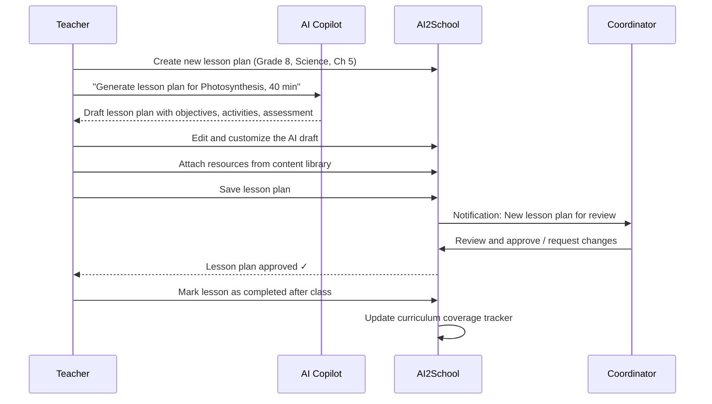
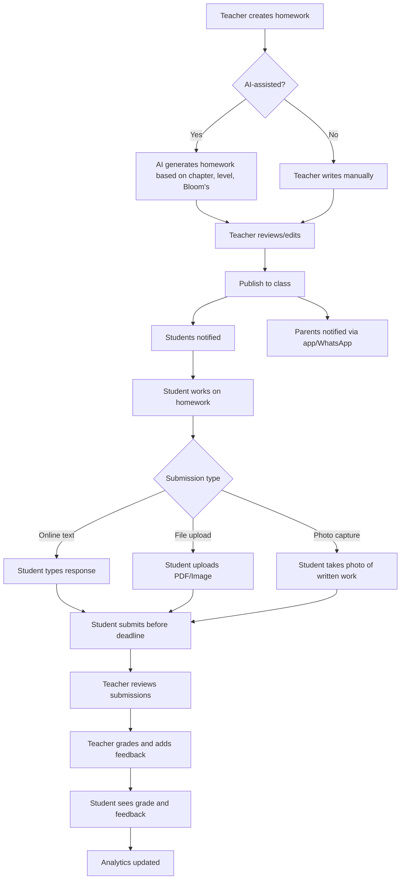

# Module 2: Learning Management System (LMS)

---

## Overview

The LMS module provides a digital backbone for academic content delivery, homework management, and learning progress tracking. It is tightly integrated with the ERP (timetable, subjects, students) and the AI Copilot (content suggestions, adaptive assignments).

---

## 2.1 Digital Content Library

### User Stories

| ID | As a... | I want to... | So that... | Priority |
|---|---|---|---|---|
| LMS-001 | Teacher | upload and organize learning materials (PDFs, PPTs, videos, links) by subject/chapter | students can access resources digitally | P0 |
| LMS-002 | Student | access learning materials shared by my teachers | I can study and revise | P0 |
| LMS-003 | Coordinator | create a shared resource library for the department | teachers can reuse quality content | P1 |
| LMS-004 | Teacher | tag content to curriculum chapters and learning outcomes | content is curriculum-aligned | P1 |
| LMS-005 | Admin | manage storage quotas per teacher/school | storage costs are controlled | P2 |

### Content Organization Hierarchy

```
School
└── Academic Year
    └── Grade
        └── Subject
            └── Chapter (Curriculum-linked)
                ├── Lesson Notes (PDF)
                ├── Presentation (PPT)
                ├── Video Link
                ├── Interactive Resource
                ├── Reference Material
                └── Practice Worksheet
```

### Database Tables

```sql
-- Content Library
CREATE TABLE lms_content (
    id UUID PRIMARY KEY DEFAULT gen_random_uuid(),
    school_id UUID NOT NULL REFERENCES schools(id),
    title VARCHAR(255) NOT NULL,
    description TEXT,
    content_type VARCHAR(30) NOT NULL, 
    -- document, presentation, video, link, image, interactive, worksheet
    
    -- File or Link
    file_path TEXT,
    file_size INTEGER,
    mime_type VARCHAR(100),
    external_url TEXT,
    thumbnail_url TEXT,
    duration_minutes INTEGER, -- For videos
    
    -- Academic Mapping
    grade_id UUID REFERENCES grades(id),
    subject_id UUID REFERENCES subjects(id),
    chapter_id UUID REFERENCES curriculum_chapters(id),
    learning_outcome_ids UUID[], -- Mapped learning outcomes
    
    -- Visibility
    visibility VARCHAR(20) DEFAULT 'class', -- class, grade, school, department
    shared_with_section_ids UUID[],
    
    -- Metadata
    tags TEXT[],
    uploaded_by UUID NOT NULL REFERENCES users(id),
    approved BOOLEAN DEFAULT TRUE,
    view_count INTEGER DEFAULT 0,
    download_count INTEGER DEFAULT 0,
    
    created_at TIMESTAMP DEFAULT NOW(),
    updated_at TIMESTAMP DEFAULT NOW()
);

CREATE INDEX idx_lms_content_subject ON lms_content(school_id, grade_id, subject_id);
CREATE INDEX idx_lms_content_chapter ON lms_content(chapter_id);

-- Content Access Log (for analytics)
CREATE TABLE lms_content_access_log (
    id UUID PRIMARY KEY DEFAULT gen_random_uuid(),
    content_id UUID NOT NULL REFERENCES lms_content(id),
    user_id UUID NOT NULL REFERENCES users(id),
    user_type VARCHAR(20), -- student, teacher, parent
    action VARCHAR(20), -- view, download, play
    duration_seconds INTEGER,
    created_at TIMESTAMP DEFAULT NOW()
);
```

---

## 2.2 Lesson Planning

### User Stories

| ID | As a... | I want to... | So that... | Priority |
|---|---|---|---|---|
| LMS-010 | Teacher | create lesson plans linked to curriculum chapters | my teaching is structured and trackable | P0 |
| LMS-011 | Teacher | use AI to generate lesson plan drafts | planning time is reduced | P1 |
| LMS-012 | Coordinator | review and approve lesson plans for my department | teaching quality is monitored | P1 |
| LMS-013 | Teacher | track curriculum coverage (chapters completed vs. planned) | I can ensure syllabus completion | P0 |
| LMS-014 | Academic Head | view curriculum coverage across all classes | I can identify delays | P1 |

### Lesson Plan Workflow



### Database Tables

```sql
-- Lesson Plans
CREATE TABLE lesson_plans (
    id UUID PRIMARY KEY DEFAULT gen_random_uuid(),
    school_id UUID NOT NULL REFERENCES schools(id),
    teacher_id UUID NOT NULL REFERENCES staff(id),
    academic_year_id UUID NOT NULL REFERENCES academic_years(id),
    
    -- Academic Context
    grade_id UUID NOT NULL REFERENCES grades(id),
    section_id UUID REFERENCES sections(id),
    subject_id UUID NOT NULL REFERENCES subjects(id),
    chapter_id UUID REFERENCES curriculum_chapters(id),
    topic VARCHAR(255) NOT NULL,
    
    -- Plan Details
    plan_date DATE NOT NULL,
    duration_minutes INTEGER DEFAULT 40,
    plan_type VARCHAR(20) DEFAULT 'daily', -- daily, weekly, monthly
    
    -- Content (structured)
    learning_objectives TEXT[], -- Specific learning objectives
    prerequisite_knowledge TEXT,
    teaching_methodology TEXT, -- Lecture, Discussion, Activity-based, etc.
    introduction TEXT,        -- Hook / engagement strategy
    main_content TEXT,        -- Core teaching content
    activities JSONB,         -- [{name, description, duration, type}]
    assessment_strategy TEXT, -- How learning will be assessed
    homework TEXT,
    resources JSONB,          -- [{type, title, content_id or url}]
    differentiation TEXT,     -- For different learning levels
    reflection TEXT,          -- Post-class teacher notes
    
    -- Bloom's Taxonomy
    blooms_levels TEXT[],     -- remember, understand, apply, analyze, evaluate, create
    
    -- AI
    ai_generated BOOLEAN DEFAULT FALSE,
    ai_prompt TEXT,
    ai_model_used VARCHAR(50),
    
    -- Status
    status VARCHAR(20) DEFAULT 'draft', -- draft, submitted, approved, revision_requested, completed
    reviewed_by UUID REFERENCES users(id),
    review_comments TEXT,
    completed_at TIMESTAMP,
    
    created_at TIMESTAMP DEFAULT NOW(),
    updated_at TIMESTAMP DEFAULT NOW()
);

-- Curriculum Coverage Tracker
CREATE TABLE curriculum_coverage (
    id UUID PRIMARY KEY DEFAULT gen_random_uuid(),
    school_id UUID NOT NULL REFERENCES schools(id),
    academic_year_id UUID NOT NULL REFERENCES academic_years(id),
    grade_id UUID NOT NULL REFERENCES grades(id),
    section_id UUID NOT NULL REFERENCES sections(id),
    subject_id UUID NOT NULL REFERENCES subjects(id),
    chapter_id UUID NOT NULL REFERENCES curriculum_chapters(id),
    teacher_id UUID NOT NULL REFERENCES staff(id),
    
    planned_start_date DATE,
    planned_end_date DATE,
    actual_start_date DATE,
    actual_end_date DATE,
    status VARCHAR(20) DEFAULT 'not_started', -- not_started, in_progress, completed, skipped
    completion_percentage DECIMAL(5,2) DEFAULT 0,
    remarks TEXT,
    
    created_at TIMESTAMP DEFAULT NOW(),
    updated_at TIMESTAMP DEFAULT NOW(),
    
    UNIQUE(school_id, academic_year_id, grade_id, section_id, subject_id, chapter_id)
);
```

---

## 2.3 Homework Management

### User Stories

| ID | As a... | I want to... | So that... | Priority |
|---|---|---|---|---|
| LMS-020 | Teacher | assign homework to my class with due date and instructions | homework is tracked digitally | P0 |
| LMS-021 | Teacher | use AI to generate personalized homework | homework is differentiated | P1 |
| LMS-022 | Student | view homework assigned to me with due dates | I know what to complete | P0 |
| LMS-023 | Student | submit homework online (file upload, text, photo) | submission is convenient | P0 |
| LMS-024 | Teacher | review and grade homework submissions | assessment is organized | P0 |
| LMS-025 | Parent | view pending homework for my child | I can ensure completion | P0 |
| LMS-026 | Teacher | track homework completion rates per student | I can identify struggling students | P1 |

### Homework Workflow



### Database Tables

```sql
-- Homework Assignments
CREATE TABLE homework (
    id UUID PRIMARY KEY DEFAULT gen_random_uuid(),
    school_id UUID NOT NULL REFERENCES schools(id),
    teacher_id UUID NOT NULL REFERENCES staff(id),
    academic_year_id UUID NOT NULL REFERENCES academic_years(id),
    
    -- Academic Context
    grade_id UUID NOT NULL REFERENCES grades(id),
    section_ids UUID[] NOT NULL, -- Can assign to multiple sections
    subject_id UUID NOT NULL REFERENCES subjects(id),
    chapter_id UUID REFERENCES curriculum_chapters(id),
    
    -- Content
    title VARCHAR(255) NOT NULL,
    description TEXT NOT NULL,
    instructions TEXT,
    attachments JSONB, -- [{name, url, type}]
    
    -- Submission Settings
    submission_type VARCHAR(20) NOT NULL, -- text, file, photo, link, offline
    max_file_size_mb INTEGER DEFAULT 10,
    allowed_file_types TEXT[], -- ['pdf', 'jpg', 'png', 'docx']
    max_marks DECIMAL(5,1),
    
    -- Dates
    assigned_date DATE NOT NULL DEFAULT CURRENT_DATE,
    due_date TIMESTAMP NOT NULL,
    late_submission_allowed BOOLEAN DEFAULT FALSE,
    late_submission_deadline TIMESTAMP,
    
    -- AI
    ai_generated BOOLEAN DEFAULT FALSE,
    ai_difficulty VARCHAR(20), -- easy, medium, hard, mixed
    ai_blooms_levels TEXT[],
    
    status VARCHAR(20) DEFAULT 'published', -- draft, published, closed
    created_at TIMESTAMP DEFAULT NOW(),
    updated_at TIMESTAMP DEFAULT NOW()
);

-- Homework Submissions
CREATE TABLE homework_submissions (
    id UUID PRIMARY KEY DEFAULT gen_random_uuid(),
    homework_id UUID NOT NULL REFERENCES homework(id),
    student_id UUID NOT NULL REFERENCES students(id),
    
    -- Submission Content
    submission_text TEXT,
    submission_files JSONB, -- [{name, url, type, size}]
    
    -- Grading
    marks_obtained DECIMAL(5,1),
    grade VARCHAR(5),
    feedback TEXT,
    graded_by UUID REFERENCES users(id),
    graded_at TIMESTAMP,
    
    -- Status
    status VARCHAR(20) DEFAULT 'submitted', -- submitted, late, graded, returned, resubmitted
    submitted_at TIMESTAMP DEFAULT NOW(),
    is_late BOOLEAN DEFAULT FALSE,
    
    created_at TIMESTAMP DEFAULT NOW(),
    updated_at TIMESTAMP DEFAULT NOW(),
    
    UNIQUE(homework_id, student_id)
);
```

---

## 2.4 Assignment Submission & Classroom Resources

### User Stories

| ID | As a... | I want to... | So that... | Priority |
|---|---|---|---|---|
| LMS-030 | Teacher | create class assignments (projects, activities, lab reports) | academic work is tracked | P1 |
| LMS-031 | Teacher | share class resources (notes, links, reference materials) | students have easy access | P0 |
| LMS-032 | Student | view a unified feed of homework, assignments, and resources for my class | I don't miss anything | P0 |
| LMS-033 | Teacher | create a class discussion board | students can discuss topics | P2 |

### Database Tables

```sql
-- Assignments (broader than homework — projects, activities)
CREATE TABLE assignments (
    id UUID PRIMARY KEY DEFAULT gen_random_uuid(),
    school_id UUID NOT NULL REFERENCES schools(id),
    teacher_id UUID NOT NULL REFERENCES staff(id),
    
    grade_id UUID NOT NULL REFERENCES grades(id),
    section_ids UUID[] NOT NULL,
    subject_id UUID NOT NULL REFERENCES subjects(id),
    
    title VARCHAR(255) NOT NULL,
    description TEXT NOT NULL,
    assignment_type VARCHAR(30), -- project, activity, lab_report, presentation, essay
    instructions TEXT,
    attachments JSONB,
    rubric JSONB, -- [{criteria, max_marks, description}]
    
    max_marks DECIMAL(5,1),
    due_date TIMESTAMP NOT NULL,
    submission_type VARCHAR(20) DEFAULT 'file',
    
    is_group_assignment BOOLEAN DEFAULT FALSE,
    max_group_size INTEGER,
    
    status VARCHAR(20) DEFAULT 'published',
    created_at TIMESTAMP DEFAULT NOW(),
    updated_at TIMESTAMP DEFAULT NOW()
);

-- Assignment Submissions
CREATE TABLE assignment_submissions (
    id UUID PRIMARY KEY DEFAULT gen_random_uuid(),
    assignment_id UUID NOT NULL REFERENCES assignments(id),
    student_id UUID NOT NULL REFERENCES students(id),
    group_id UUID, -- For group assignments
    
    submission_text TEXT,
    submission_files JSONB,
    
    marks_obtained DECIMAL(5,1),
    rubric_scores JSONB, -- [{criteria, score, feedback}]
    overall_feedback TEXT,
    graded_by UUID REFERENCES users(id),
    graded_at TIMESTAMP,
    
    status VARCHAR(20) DEFAULT 'submitted',
    submitted_at TIMESTAMP DEFAULT NOW(),
    
    UNIQUE(assignment_id, student_id)
);

-- Class Feed / Stream
CREATE TABLE class_feed (
    id UUID PRIMARY KEY DEFAULT gen_random_uuid(),
    school_id UUID NOT NULL REFERENCES schools(id),
    grade_id UUID NOT NULL REFERENCES grades(id),
    section_id UUID NOT NULL REFERENCES sections(id),
    subject_id UUID REFERENCES subjects(id),
    
    feed_type VARCHAR(20) NOT NULL, -- homework, assignment, resource, announcement, discussion
    reference_id UUID, -- ID of homework, assignment, content, etc.
    
    title VARCHAR(255) NOT NULL,
    body TEXT,
    posted_by UUID NOT NULL REFERENCES users(id),
    pinned BOOLEAN DEFAULT FALSE,
    
    created_at TIMESTAMP DEFAULT NOW()
);
```

---

## 2.5 Learning Progress Tracking

### User Stories

| ID | As a... | I want to... | So that... | Priority |
|---|---|---|---|---|
| LMS-040 | Teacher | track per-student progress on homework completion, assignment scores, and content engagement | I can intervene for struggling students | P1 |
| LMS-041 | Student | view my learning dashboard showing progress by subject/chapter | I know where I stand | P1 |
| LMS-042 | Parent | view my child's learning progress (homework completion rate, scores trend) | I can support my child | P1 |
| LMS-043 | Teacher | view class-level analytics: average scores, completion rates, engagement | I can adjust my teaching | P1 |

### Progress Tracking Data Model

```sql
-- Student Learning Progress (aggregated view)
CREATE TABLE student_learning_progress (
    id UUID PRIMARY KEY DEFAULT gen_random_uuid(),
    student_id UUID NOT NULL REFERENCES students(id),
    academic_year_id UUID NOT NULL REFERENCES academic_years(id),
    subject_id UUID NOT NULL REFERENCES subjects(id),
    chapter_id UUID REFERENCES curriculum_chapters(id),
    
    -- Metrics
    homework_assigned INTEGER DEFAULT 0,
    homework_submitted INTEGER DEFAULT 0,
    homework_avg_score DECIMAL(5,2),
    
    assignment_count INTEGER DEFAULT 0,
    assignment_avg_score DECIMAL(5,2),
    
    content_viewed INTEGER DEFAULT 0,
    content_total_time_minutes INTEGER DEFAULT 0,
    
    quiz_attempted INTEGER DEFAULT 0,
    quiz_avg_score DECIMAL(5,2),
    
    -- AI-computed
    mastery_level VARCHAR(20), -- beginner, developing, proficient, advanced
    learning_gaps JSONB, -- [{topic, gap_type, severity}]
    recommended_resources UUID[], -- Content IDs
    
    last_updated TIMESTAMP DEFAULT NOW(),
    
    UNIQUE(student_id, academic_year_id, subject_id, chapter_id)
);
```

### API Endpoints (LMS)

```
# Content Library
POST   /api/v1/lms/content                     # Upload content
GET    /api/v1/lms/content                      # List content (filtered)
GET    /api/v1/lms/content/{id}                 # Get content details
PUT    /api/v1/lms/content/{id}                 # Update content
DELETE /api/v1/lms/content/{id}                 # Delete content
POST   /api/v1/lms/content/{id}/access          # Log content access

# Lesson Plans
POST   /api/v1/lms/lesson-plans                 # Create lesson plan
GET    /api/v1/lms/lesson-plans                  # List lesson plans
GET    /api/v1/lms/lesson-plans/{id}             # Get lesson plan
PUT    /api/v1/lms/lesson-plans/{id}             # Update lesson plan
PUT    /api/v1/lms/lesson-plans/{id}/status      # Update status (submit/approve/complete)
POST   /api/v1/lms/lesson-plans/generate         # AI generate lesson plan

# Homework
POST   /api/v1/lms/homework                      # Create homework
GET    /api/v1/lms/homework                       # List homework (by class, subject, date)
GET    /api/v1/lms/homework/{id}                  # Get homework details
PUT    /api/v1/lms/homework/{id}                  # Update homework
GET    /api/v1/lms/homework/{id}/submissions      # List submissions
POST   /api/v1/lms/homework/{id}/submit           # Submit homework (student)
PUT    /api/v1/lms/homework/{id}/submissions/{subId}/grade  # Grade submission

# Assignments
POST   /api/v1/lms/assignments                    # Create assignment
GET    /api/v1/lms/assignments                     # List assignments
POST   /api/v1/lms/assignments/{id}/submit         # Submit assignment
PUT    /api/v1/lms/assignments/{id}/submissions/{subId}/grade  # Grade submission

# Progress
GET    /api/v1/lms/progress/student/{studentId}    # Student's learning progress
GET    /api/v1/lms/progress/class/{classId}         # Class-level progress
GET    /api/v1/lms/progress/coverage/{subjectId}    # Curriculum coverage

# Curriculum
GET    /api/v1/curriculum/{boardId}/grades           # List grades for a board
GET    /api/v1/curriculum/{boardId}/grades/{gradeId}/subjects  # Subjects
GET    /api/v1/curriculum/subjects/{subjectId}/chapters        # Chapters
GET    /api/v1/curriculum/chapters/{chapterId}/outcomes        # Learning outcomes
```

---

*Next: [Module 3: AI Teacher Copilot →](./04-module-ai-teacher-copilot.md)*
