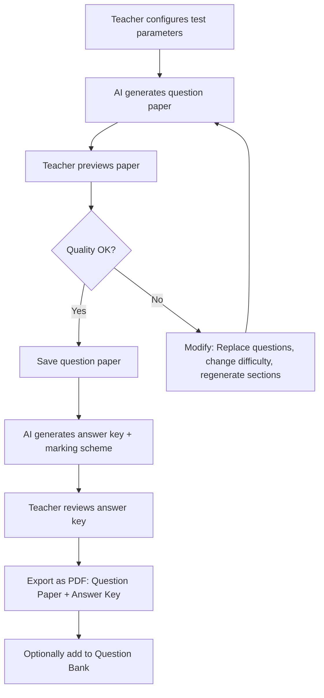
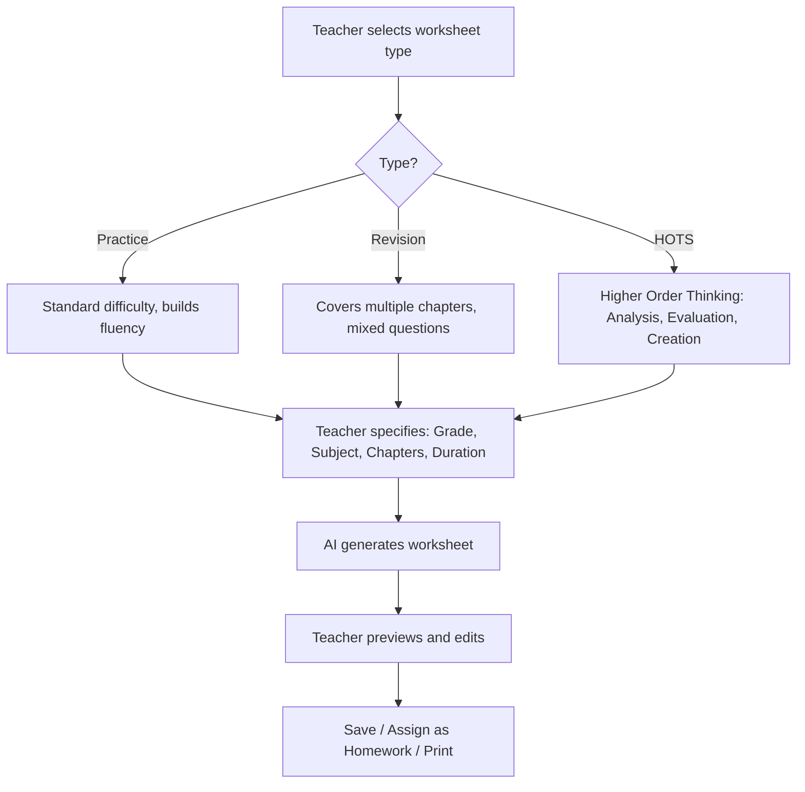
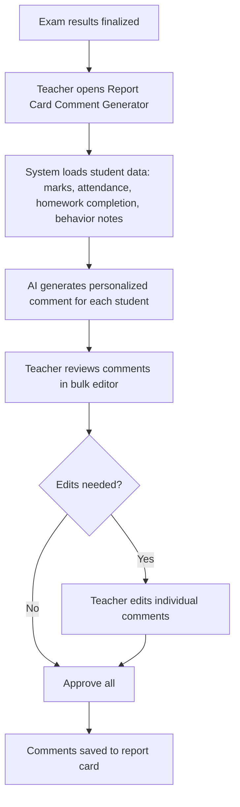

# Module 3: AI Teacher Copilot — Complete Design

---

## Overview

The AI Teacher Copilot is a workflow-integrated AI assistant that helps teachers generate lesson plans, question papers, worksheets, homework, report card comments, and parent communications. It is NOT a chatbot — it is a purpose-built tool that produces artifacts teachers actually use, with full curriculum awareness, Bloom's taxonomy alignment, and school-specific customization.

### Design Philosophy

1. **Generate, Don't Chat**: Produce structured outputs (PDFs, formatted plans, papers) — not conversational responses
2. **Curriculum-Grounded**: Every output references specific chapters, learning outcomes, and board requirements
3. **Teacher-in-the-Loop**: AI generates drafts; teachers review, edit, and approve
4. **School-Configurable**: Templates, rubrics, and formats follow each school's specific standards
5. **Quality Guardrails**: Content filtering, factual accuracy checks, and board-compliance validation

---

## 3.1 AI Lesson Planner

### Workflow

```mermaid
flowchart TD
    A[Teacher selects: Grade + Subject + Chapter + Duration] --> B[AI generates lesson plan draft]
    B --> C{Plan type}
    C -->|Daily| D[Single period plan: Objective, Hook, Activities, Assessment]
    C -->|Weekly| E[5-day plan: Daily breakdown with progression]
    C -->|Monthly| F[4-week plan: Chapter pacing, assessment points]
    D & E & F --> G[Teacher reviews in rich editor]
    G --> H{Satisfied?}
    H -->|Yes| I[Save and link to timetable]
    H -->|No| J[Regenerate with feedback: "Make it more activity-based"]
    J --> B
    I --> K[Optionally submit for coordinator review]
    K --> L[Coordinator approves or requests changes]
```

### Inputs

| Input | Type | Required | Description |
|---|---|---|---|
| Grade | Dropdown | Yes | Class 1-12 |
| Subject | Dropdown | Yes | Auto-populated based on teacher's assignments |
| Chapter/Topic | Dropdown + Text | Yes | From curriculum database + custom topic |
| Plan Type | Dropdown | Yes | Daily, Weekly, Monthly |
| Duration | Number | Yes | Minutes per period (default: 40) |
| Teaching Method Preference | Multi-select | No | Lecture, Activity, Discussion, Lab, Flipped |
| Student Level | Dropdown | No | Below average, Average, Above average, Mixed |
| Special Instructions | Text | No | Free text for additional context |
| Board | Auto-detected | Yes | CBSE, ICSE, State Board (from school config) |

### Outputs (Structured)

```json
{
  "lesson_plan": {
    "metadata": {
      "grade": "8",
      "subject": "Science",
      "chapter": "Cell - Structure and Functions",
      "topic": "Parts of a Cell",
      "board": "CBSE",
      "duration_minutes": 40,
      "blooms_levels": ["remember", "understand", "apply"]
    },
    "learning_objectives": [
      "Students will be able to identify the major parts of a cell",
      "Students will be able to differentiate between plant and animal cells",
      "Students will be able to explain the function of cell organelles"
    ],
    "prerequisite_knowledge": "Basic understanding of living organisms and their classification",
    "materials_needed": ["Cell diagram chart", "Microscope (if available)", "Colored pencils"],
    "plan": {
      "introduction": {
        "duration": 5,
        "activity": "Show a magnified image of a cell. Ask: 'What do you think is the smallest unit of life?'",
        "purpose": "Hook students' curiosity and activate prior knowledge"
      },
      "main_content": {
        "duration": 20,
        "sections": [
          {
            "topic": "Cell Theory",
            "method": "Interactive Lecture",
            "key_points": ["All living things are made of cells", "Cell is the basic unit of life"],
            "duration": 7
          },
          {
            "topic": "Parts of a Cell",
            "method": "Diagram-based Teaching",
            "key_points": ["Cell membrane", "Cytoplasm", "Nucleus", "Organelles"],
            "duration": 13
          }
        ]
      },
      "activities": [
        {
          "name": "Cell Labeling Activity",
          "type": "individual",
          "duration": 8,
          "description": "Students label a blank cell diagram with organelle names and functions",
          "blooms_level": "apply"
        }
      ],
      "assessment": {
        "duration": 5,
        "type": "exit_ticket",
        "questions": [
          "Name 3 organelles found in both plant and animal cells",
          "What is the function of the nucleus?"
        ]
      },
      "closure": {
        "duration": 2,
        "activity": "Recap key learnings. Preview: Tomorrow we'll look at cells under a microscope."
      }
    },
    "homework": "Draw and label a plant cell and an animal cell. Highlight 3 differences.",
    "differentiation": {
      "struggling": "Provide pre-labeled diagram for reference",
      "advanced": "Research and present on one organelle not covered in class"
    },
    "cross_curricular_links": "Math: Scale and magnification; Art: Scientific illustration"
  }
}
```

### Prompt Design

```
SYSTEM PROMPT:
You are an expert educational curriculum planner for Indian K-12 schools. 
You generate detailed, practical lesson plans that teachers can use directly in the classroom.

CONTEXT:
- Board: {board_name} (e.g., CBSE)
- Academic Framework: {ncf_guidelines}
- Chapter Details: {chapter_name}, {chapter_description}, {learning_outcomes}
- Previous lessons in this chapter: {previous_lesson_summaries}

CONSTRAINTS:
- All content must be factually accurate and age-appropriate for Grade {grade}
- Align activities to specified Bloom's taxonomy levels
- Total activities must fit within {duration} minutes
- Use Indian contexts and examples where appropriate
- Do NOT include any content unrelated to the subject
- Do NOT generate content that could be controversial, political, or religiously sensitive

USER PROMPT:
Generate a {plan_type} lesson plan for:
- Grade: {grade}
- Subject: {subject}
- Chapter: {chapter}
- Topic: {topic}  
- Duration: {duration} minutes per period
- Teaching preference: {method_preference}
- Student level: {student_level}
- Special instructions: {special_instructions}

OUTPUT FORMAT: Return a structured JSON following the lesson plan schema.
```

### UI Design

1. **Input Panel** (Left side)
   - Grade/Subject/Chapter dropdowns (pre-populated from curriculum DB)
   - Plan type selector (Daily/Weekly/Monthly)
   - Duration input
   - Teaching method preference chips
   - Student level selector
   - Special instructions textarea
   - "Generate Plan" button with AI sparkle icon

2. **Output Panel** (Right side - rich editor)
   - Formatted lesson plan with collapsible sections
   - Inline editing for all fields
   - Drag-and-drop to reorder activities
   - "Regenerate Section" button on each section
   - "Regenerate All" with feedback input
   - Bloom's taxonomy color-coded tags
   - "Save as Draft" / "Save & Submit for Review" actions
   - "Export to PDF" / "Print" options

### Guardrails

| Guardrail | Implementation |
|---|---|
| Factual Accuracy | RAG from curriculum knowledge base; cross-reference with NCERT/textbook content |
| Age Appropriateness | Grade-level vocabulary and complexity constraints in prompt |
| Curriculum Alignment | Validate generated outcomes against official learning outcome database |
| Content Safety | Input/output filtering for inappropriate content, bias, stereotypes |
| Time Feasibility | Validate total activity durations sum to specified period length |
| Plagiarism | Generated content is original; not copied from copyrighted textbooks |

---

## 3.2 AI Test Generator

### Workflow



### Inputs

| Input | Type | Required | Description |
|---|---|---|---|
| Grade | Dropdown | Yes | Class 1-12 |
| Subject | Dropdown | Yes | Auto-populated |
| Chapters | Multi-select | Yes | One or more chapters from curriculum |
| Exam Type | Dropdown | Yes | Unit Test, Mid-term, Final, Practice |
| Total Marks | Number | Yes | e.g., 30, 50, 80, 100 |
| Duration | Number | Yes | Minutes |
| Question Types | Multi-select | Yes | MCQ, Short Answer, Long Answer, Fill in the Blanks, True/False, Match, Diagram-based, Assertion-Reason, Case Study |
| Difficulty Mix | Sliders | Yes | Easy/Medium/Hard distribution (%) |
| Bloom's Levels | Multi-select | No | Remember, Understand, Apply, Analyze, Evaluate, Create |
| Chapter Weightage | Per chapter | No | Marks distribution across chapters |
| Special Instructions | Text | No | "Include at least 2 diagram-based questions" |
| Board Pattern | Auto-detected | Yes | Follow CBSE/ICSE pattern |

### Outputs

```json
{
  "question_paper": {
    "metadata": {
      "school_name": "{{school_name}}",
      "exam_name": "Unit Test 2",
      "grade": "10",
      "subject": "Science",
      "total_marks": 40,
      "duration_minutes": 90,
      "chapters_covered": ["Chemical Reactions", "Acids, Bases and Salts"],
      "general_instructions": [
        "All questions are compulsory.",
        "Question 1 to 5 carry 1 mark each.",
        "Question 6 to 10 carry 2 marks each.",
        "Question 11 to 13 carry 3 marks each.",
        "Question 14 carries 5 marks."
      ]
    },
    "sections": [
      {
        "name": "Section A",
        "description": "Very Short Answer Questions (1 mark each)",
        "questions": [
          {
            "q_number": 1,
            "type": "mcq",
            "marks": 1,
            "difficulty": "easy",
            "blooms_level": "remember",
            "chapter": "Chemical Reactions",
            "question": "Which of the following is an example of a decomposition reaction?",
            "options": [
              "A) 2Mg + O₂ → 2MgO",
              "B) 2H₂O → 2H₂ + O₂",
              "C) Fe + CuSO₄ → FeSO₄ + Cu",
              "D) NaOH + HCl → NaCl + H₂O"
            ],
            "answer": "B",
            "explanation": "Electrolysis of water breaks a compound into simpler substances (H₂ and O₂), which is a decomposition reaction."
          }
          // ... more questions
        ]
      }
      // ... more sections
    ]
  },
  "answer_key": {
    "answers": [
      {
        "q_number": 1,
        "answer": "B) 2H₂O → 2H₂ + O₂",
        "marking_scheme": "1 mark for correct option"
      }
      // ... all answers
    ]
  },
  "analysis": {
    "difficulty_distribution": {"easy": 30, "medium": 50, "hard": 20},
    "blooms_distribution": {"remember": 20, "understand": 30, "apply": 25, "analyze": 15, "evaluate": 10},
    "chapter_distribution": {"Chemical Reactions": 22, "Acids Bases Salts": 18}
  }
}
```

### Prompt Design

```
SYSTEM PROMPT:
You are an expert exam paper setter for Indian K-12 schools.
You create question papers that are balanced, curriculum-aligned, and follow board patterns.

CONTEXT:
- Board: {board}
- Chapter Content: {chapter_content_from_rag}
- Learning Outcomes: {learning_outcomes}
- Board paper pattern: {board_pattern_examples}
- Previous papers generated (to avoid repetition): {previous_paper_hashes}

CONSTRAINTS:
- Questions must be original — never copy directly from textbooks or previous board papers
- Every question must be factually correct with a verifiable answer
- MCQ distractors must be plausible but clearly wrong
- Difficulty distribution must match the requested mix
- Mark allocation must sum to exactly {total_marks}
- Long answer questions must require multi-step reasoning
- For CBSE Science, follow the pattern of Sections A/B/C/D
- Include internal choice where specified by board pattern
- All content must be appropriate for Grade {grade} students

USER PROMPT:
Generate a question paper with these parameters:
{parameters_json}

OUTPUT: Structured JSON following the question paper schema.
Separately generate an answer key with marking scheme.
```

### UI Design

1. **Configuration Panel**
   - Interactive form with all input parameters
   - Difficulty distribution as visual sliders with real-time percentage display
   - Chapter weightage table with marks allocation
   - Bloom's taxonomy visual selector (pyramid graphic)
   - Preview of paper structure before generation

2. **Paper Preview**
   - Formatted like a real exam paper with school header
   - Question numbering, marks in brackets, sections
   - Each question has: Edit, Replace, Regenerate, Remove buttons
   - Drag-and-drop to reorder questions
   - Difficulty and Bloom's tags on hover
   - Real-time marks total counter

3. **Answer Key View**
   - Side-by-side with question paper
   - Marking scheme with step-wise marks allocation
   - "Add to Question Bank" button per question

4. **Export Options**
   - PDF (Question Paper only / Answer Key only / Both)
   - Word/DOCX format
   - Print-ready format with school logo

### Guardrails

| Guardrail | Implementation |
|---|---|
| Mark Total Validation | Programmatic check that all marks sum to specified total |
| Difficulty Balance | Validate distribution matches ±5% of requested mix |
| No Textbook Copying | Similarity check against known textbook question banks |
| Factual Verification | RAG-validated answers; flag low-confidence questions for teacher review |
| Board Pattern Compliance | Validate section structure against board pattern templates |
| Chapter Coverage | Ensure all selected chapters are represented proportionally |
| Duplication Prevention | Hash comparison against previously generated papers |

---

## 3.3 AI Worksheet Generator

### Workflow



### Inputs

| Input | Type | Required |
|---|---|---|
| Worksheet Type | Practice / Revision / HOTS | Yes |
| Grade | Dropdown | Yes |
| Subject | Dropdown | Yes |
| Chapters | Multi-select | Yes |
| Number of Questions | Number | Yes |
| Expected Completion Time | Minutes | No |
| Include Answer Key | Toggle | No |
| Special Focus | Text | No |

### Prompt Design

```
SYSTEM PROMPT:
You generate educational worksheets for K-12 students.

WORKSHEET TYPE INSTRUCTIONS:
- Practice: Focus on procedural fluency. Include worked examples. Gradually increase difficulty. 
  Target Bloom's: Remember, Understand, Apply.
- Revision: Cover all key concepts from selected chapters. Include a mix of question types. 
  Target Bloom's: All levels, weighted towards Remember and Understand.
- HOTS: Higher Order Thinking Skills only. Include case studies, data analysis, open-ended questions, 
  real-world applications. Target Bloom's: Analyze, Evaluate, Create.

CONSTRAINTS:
- Questions must be solvable by Grade {grade} students
- Include clear instructions for each section
- For Math/Science: Show required formulas at the top
- For Language: Include appropriate text passages
- Format for clean printing on A4 paper
- Estimate completion time and mention it at the top
```

---

## 3.4 AI Homework Generator

### Workflow

Teacher selects chapter → AI generates differentiated homework based on student performance data.

### Inputs

| Input | Type | Required |
|---|---|---|
| Grade + Section | Dropdown | Yes |
| Subject | Dropdown | Yes |
| Chapter/Topic | Dropdown | Yes |
| Homework Type | Practice / Reading / Creative / Research | Yes |
| Difficulty | Easy / Medium / Hard / Adaptive | Yes |
| Estimated Time | Minutes | Yes |
| Personalized | Toggle | No |

### Personalization Logic (when enabled)

```
IF student_mastery_level(chapter) == "advanced":
    difficulty = "hard"
    include HOTS questions
    add extension activities
ELIF student_mastery_level(chapter) == "proficient":
    difficulty = "medium"
    standard practice + 1 HOTS
ELIF student_mastery_level(chapter) == "developing":
    difficulty = "easy-medium"
    include worked examples
    focus on fundamentals
ELSE: // beginner
    difficulty = "easy"
    include step-by-step guidance
    fewer questions, more scaffolding
```

---

## 3.5 AI Report Card Comment Assistant

### Workflow



### Inputs (per student, auto-loaded)

| Data Point | Source |
|---|---|
| Student Name | Student Profile |
| Exam Marks (all subjects) | Marks Entry |
| Grade/Rank | Calculated |
| Attendance % | Attendance Module |
| Homework Completion Rate | LMS |
| Strengths (subjects above 80%) | Analytics |
| Areas for Improvement (subjects below 60%) | Analytics |
| Behavioral Notes | Teacher notes (optional) |
| Extracurricular Achievements | Manual entry |
| Previous Term Comment | Report Card History |

### Prompt Design

```
SYSTEM PROMPT:
You generate personalized, constructive, and encouraging report card comments for school students.

GUIDELINES:
- Start with a positive observation
- Be specific about academic performance (mention actual subjects)
- Include one area for improvement with a constructive suggestion
- Mention non-academic qualities if behavioral data is available
- Keep tone warm, professional, and encouraging
- Avoid generic phrases like "Good student" or "Needs improvement"
- Do NOT compare with other students
- Do NOT mention exact marks or percentages (use qualitative descriptions)
- Keep comment length to 60-100 words
- Use the student's first name
- For younger students (Class 1-5), use simpler, warmer language
- For senior students (Class 9-12), be more specific about academic areas

STUDENT DATA:
{student_data_json}

PREVIOUS COMMENT (for continuity):
{previous_term_comment}

Generate a report card comment for this student.
```

### Output Example

> "Ananya has shown remarkable dedication this term, particularly in Mathematics where she has consistently performed exceptionally well. Her curiosity in Science experiments is commendable. While she has made progress in Hindi, she would benefit from regular reading practice to strengthen her vocabulary. Ananya is a responsible student who actively participates in class discussions and is always willing to help her peers. Her consistent attendance reflects her commitment to learning. Keep up the wonderful work, Ananya!"

### UI Design

- **Bulk Generator View**: Table of all students with generated comments
- **Columns**: Student Name, Photo, Key Metrics (sparkline), AI Comment, Edited Comment, Status
- **Actions**: Edit inline, Regenerate for student, Approve, Approve All
- **Tone Selector**: Formal / Warm / Encouraging
- **Length Slider**: Short (40 words) / Medium (70 words) / Detailed (100 words)

---

## 3.6 AI Parent Communication Assistant

### Workflow

Teacher wants to send a message to parents → selects purpose → AI drafts message → teacher edits → sends.

### Use Cases & Prompt Templates

#### Individual Student Message

```
PURPOSE: {purpose}
-- academic_concern, behavioral_note, appreciation, attendance_alert, 
-- ptm_reminder, homework_missing, fee_reminder

STUDENT: {student_name}, Class {grade}-{section}
CONTEXT: {specific_details}
TONE: {professional | warm | urgent}
LANGUAGE: {English | Hindi | bilingual}

Generate a parent communication message for the above purpose.
Keep it concise (50-80 words), respectful, and actionable.
Include a clear call-to-action if applicable.
```

#### Bulk Message (Class/School)

```
PURPOSE: {purpose}
-- event_announcement, holiday_notice, exam_schedule, fee_reminder,
-- safety_update, curriculum_update, ptm_invitation

AUDIENCE: {all_parents | grade_X | section_Y}
DETAILS: {event_details}
TONE: {professional | warm}

Generate a school communication for the above purpose.
Include all necessary details (date, time, venue, action required).
Keep it professional and clear.
```

### Guardrails

| Guardrail | Rule |
|---|---|
| No Shaming | Never include language that shames students or parents |
| Factual Only | Only reference verified data from the system |
| Privacy | Never include other students' information in individual messages |
| Balanced | Academic concern messages must include at least one positive point |
| Actionable | Every message should have a clear next step or call-to-action |
| Language | Support English, Hindi; avoid jargon; use simple language |

---

## AI Copilot API Endpoints

```
# Lesson Plans
POST   /api/v1/ai/lesson-plans/generate          # Generate lesson plan
POST   /api/v1/ai/lesson-plans/regenerate-section  # Regenerate specific section

# Test Generator
POST   /api/v1/ai/tests/generate                  # Generate question paper
POST   /api/v1/ai/tests/generate-answer-key        # Generate answer key
POST   /api/v1/ai/tests/replace-question            # Replace single question

# Worksheets
POST   /api/v1/ai/worksheets/generate              # Generate worksheet

# Homework
POST   /api/v1/ai/homework/generate                # Generate homework
POST   /api/v1/ai/homework/personalize              # Generate personalized homework

# Report Card Comments
POST   /api/v1/ai/comments/generate                 # Generate comment for student
POST   /api/v1/ai/comments/generate-bulk             # Generate comments for entire class

# Parent Communication
POST   /api/v1/ai/communication/draft                # Draft parent message
POST   /api/v1/ai/communication/draft-bulk            # Draft bulk message

# Common
POST   /api/v1/ai/feedback                           # Teacher feedback on AI output (for improvement)
```

---

*Next: [Module 4: AI Student Tutor →](./05-module-ai-student-tutor.md)*
