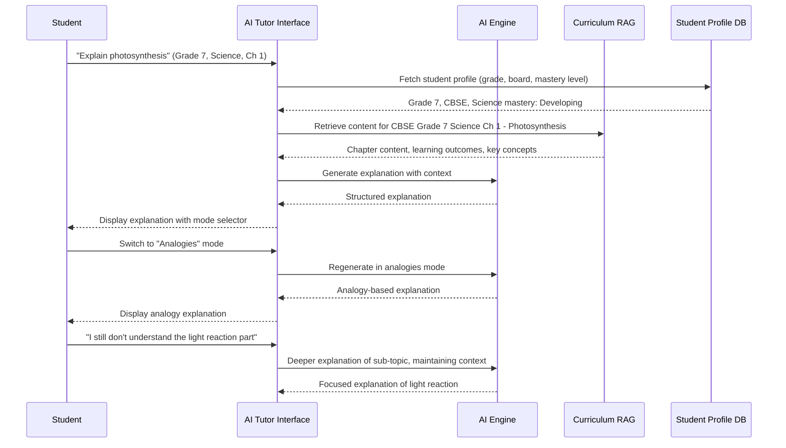
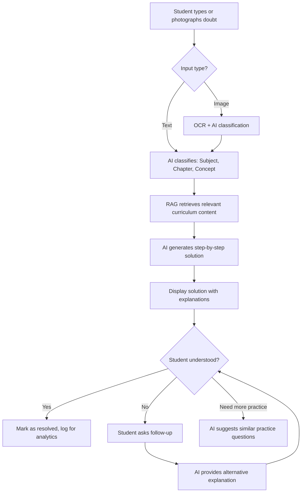
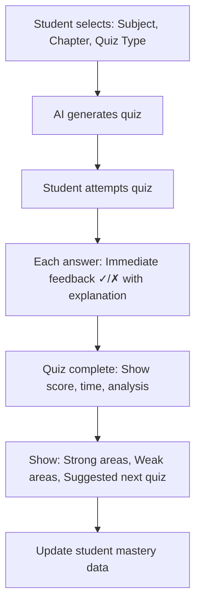
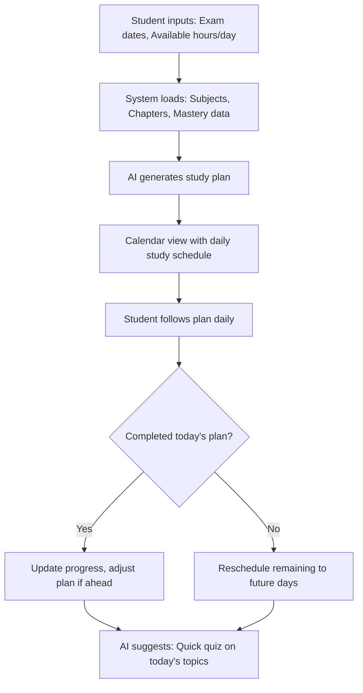
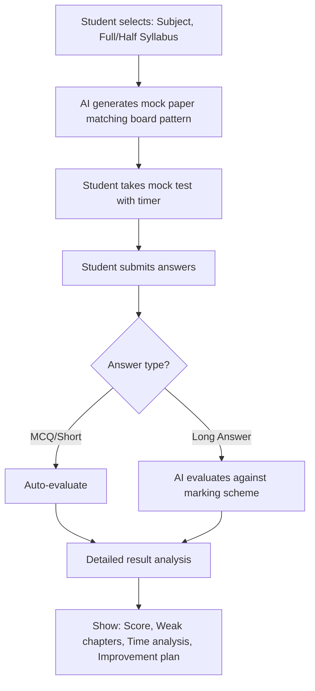

# Module 4: AI Student Tutor — Complete Design

---

## Overview

The AI Student Tutor is a curriculum-aligned, level-aware AI assistant that helps students understand concepts, solve doubts, practice questions, and prepare for exams. It operates within strict guardrails to ensure age-appropriate, accurate, and pedagogically sound interactions.

### Key Design Decisions

1. **Curriculum-First**: The tutor knows the student's board, grade, subject, and chapter — every interaction is grounded in their actual curriculum
2. **Level-Aware**: Responses adapt to the student's demonstrated mastery level (beginner → advanced)
3. **Guided, Not Answer-Giving**: The tutor explains and guides; it does NOT simply give answers
4. **Multi-Modal**: Text, diagrams (described), step-by-step, analogies — multiple explanation modes
5. **Session-Based**: Interactions happen in learning sessions, allowing context continuity
6. **Parent Visibility**: Parents can see AI tutor usage and topics covered (not full conversations)
7. **Safety-First**: Strict content filtering for student interactions

---

## 4.1 AI Explain

### Description
Students can ask the AI to explain any concept from their curriculum. The tutor provides explanations tailored to their grade level and preferred mode.

### Explanation Modes

| Mode | Description | Best For |
|---|---|---|
| **Simple Explanation** | Plain language, short, easy to understand | Quick understanding, younger students |
| **Detailed Explanation** | Comprehensive, covers all aspects | Deep understanding, senior students |
| **Examples** | Real-world and textbook examples | Making concepts relatable |
| **Analogies** | Compare concept to familiar things | Abstract or complex concepts |
| **Visual Explanation** | Descriptive diagrams, tables, flowcharts (text-based) | Visual learners, Science/Geography |
| **Step-by-Step** | Numbered steps breaking down the concept | Math, problem-solving, procedures |

### Workflow



### Prompt Design

```
SYSTEM PROMPT:
You are an AI tutor for Indian school students. You explain concepts clearly and accurately, 
adapted to the student's grade level and curriculum.

CONTEXT:
- Student: Grade {grade}, {board} Board
- Subject: {subject}
- Chapter: {chapter_name}
- Chapter Content (from textbook): {rag_retrieved_content}
- Learning Outcomes: {learning_outcomes}
- Student Mastery Level: {mastery_level}
- Previous conversation in this session: {session_history}

EXPLANATION MODE: {mode}
- simple: Use simple words, short sentences, max 150 words. Like explaining to a friend.
- detailed: Cover all aspects, definitions, formulas, exceptions. 300-500 words.
- examples: Provide 3-5 real-world examples with brief explanations. Use Indian context.
- analogies: Compare the concept to everyday things the student knows. Make it memorable.
- visual: Describe a diagram, table, or flowchart using text-based formatting.
- step_by_step: Number each step. Show the progression of the concept or problem.

RULES:
- Only use content from the student's curriculum (board and grade specific)
- Use age-appropriate language for Grade {grade}
- Never give wrong information — if uncertain, say "Let me explain what I know..."
- Don't use overly technical terms without defining them first
- Include relevant formulas/equations when applicable (use LaTeX formatting)
- Encourage the student — use phrases like "Great question!" "You're on the right track!"
- At the end, suggest a related question or topic to explore next
- NEVER discuss topics outside the academic curriculum
- NEVER share personal opinions on politics, religion, or controversial topics

STUDENT QUERY: {query}

Generate an explanation in the {mode} mode.
```

### UI Design

1. **Tutor Chat Interface**
   - Chat-like interface with student messages on right, AI on left
   - Subject/Chapter selector at top (auto-detected from context)
   - Mode selector: 6 buttons (Simple | Detailed | Examples | Analogies | Visual | Steps)
   - Rich formatting: LaTeX equations, tables, bullet points
   - "Explain Further" button on any AI response section
   - Thumbs up/down feedback on every response
   - "Save to Notes" button to bookmark explanations

2. **Topic Browser**
   - Tree view of curriculum: Subject → Chapter → Topic
   - Completion status indicators (green/yellow/red)
   - Quick access: "Explain This" button on each topic

---

## 4.2 AI Doubt Solver

### Description
Students can type or photograph their doubts. The AI identifies the subject/chapter, retrieves relevant content, and provides step-by-step solutions with explanations.

### Workflow



### Inputs
- **Text Query**: Free text doubt (e.g., "How do you solve simultaneous equations?")
- **Image**: Photo of a question from textbook/notebook
- **Context**: Auto-detected grade, subject (or student selects)

### Prompt Design

```
SYSTEM PROMPT:
You are a patient tutor helping a Grade {grade} student solve a doubt.
Your goal is to TEACH, not just give the answer.

APPROACH:
1. Identify what the student is asking
2. Explain the underlying concept briefly
3. Show the solution step by step
4. Explain WHY each step is taken
5. Highlight common mistakes to avoid
6. End with a similar practice question

RULES:
- Show all steps — never skip steps, even if they seem obvious
- For Math: Show workings clearly with proper formatting
- For Science: Include relevant laws, formulas, and units
- For Languages: Explain grammar rules with examples
- If the question is from an exercise, solve it but explain the method so the student can do similar ones
- NEVER just give the answer without explanation
- If the doubt is unclear, ask a clarifying question
```

### Guardrails

| Guardrail | Implementation |
|---|---|
| No Direct Answers | AI always shows the process, not just the final answer |
| Image Safety | OCR input filtered for non-academic content |
| Curriculum Scope | AI only answers questions within the student's curriculum |
| Attempt Tracking | Track if student is overusing doubt solver without attempting first |

---

## 4.3 AI Quiz Generator

### Description
Students can generate quick quizzes on any topic for self-assessment. Unlike the teacher's test generator, this is simpler and game-like.

### Features
- Quick Quiz: 5-10 MCQs on a topic
- Chapter Quiz: 15-20 mixed questions covering a chapter
- Challenge Mode: Timed quiz with increasing difficulty
- Mistake-Based Quiz: Questions focused on previously wrong answers

### Workflow



### UI Design
- **Gamified interface**: Points, streaks, badges
- **Timer** (optional): Adds excitement for senior students
- **Instant Feedback**: Green/Red highlight + explanation on each question
- **Progress Bar**: Visual progress through quiz
- **Results Screen**: Score, accuracy, time, comparison to previous attempts
- **Leaderboard** (class-level, opt-in): Anonymous ranking for motivation

### Database Tables

```sql
-- AI Quiz Sessions
CREATE TABLE ai_quiz_sessions (
    id UUID PRIMARY KEY DEFAULT gen_random_uuid(),
    student_id UUID NOT NULL REFERENCES students(id),
    subject_id UUID NOT NULL REFERENCES subjects(id),
    chapter_id UUID REFERENCES curriculum_chapters(id),
    quiz_type VARCHAR(20) NOT NULL, -- quick, chapter, challenge, mistake_based
    
    total_questions INTEGER NOT NULL,
    correct_answers INTEGER DEFAULT 0,
    wrong_answers INTEGER DEFAULT 0,
    skipped INTEGER DEFAULT 0,
    score DECIMAL(5,2),
    time_taken_seconds INTEGER,
    
    questions_data JSONB NOT NULL, -- [{question, options, correct, student_answer, is_correct, time_taken}]
    
    difficulty_level VARCHAR(20),
    started_at TIMESTAMP DEFAULT NOW(),
    completed_at TIMESTAMP,
    
    -- AI Metadata
    ai_model VARCHAR(50),
    ai_generation_time_ms INTEGER,
    
    created_at TIMESTAMP DEFAULT NOW()
);

-- Student Mastery Tracking (per concept)
CREATE TABLE student_mastery (
    id UUID PRIMARY KEY DEFAULT gen_random_uuid(),
    student_id UUID NOT NULL REFERENCES students(id),
    subject_id UUID NOT NULL REFERENCES subjects(id),
    chapter_id UUID NOT NULL REFERENCES curriculum_chapters(id),
    topic VARCHAR(255),
    
    -- Spaced repetition data
    total_attempts INTEGER DEFAULT 0,
    correct_attempts INTEGER DEFAULT 0,
    mastery_score DECIMAL(5,2) DEFAULT 0, -- 0-100
    mastery_level VARCHAR(20) DEFAULT 'beginner', -- beginner, developing, proficient, advanced
    
    last_practiced_at TIMESTAMP,
    next_review_at TIMESTAMP, -- Spaced repetition scheduling
    ease_factor DECIMAL(3,2) DEFAULT 2.5, -- SM-2 algorithm
    interval_days INTEGER DEFAULT 1,
    
    weak_subtopics TEXT[],
    strong_subtopics TEXT[],
    
    updated_at TIMESTAMP DEFAULT NOW(),
    
    UNIQUE(student_id, subject_id, chapter_id, topic)
);
```

---

## 4.4 AI Practice Mode

### Description
Focused practice sessions where AI generates questions of appropriate difficulty and adapts based on student performance in real-time.

### Adaptive Difficulty Algorithm

```
function getNextQuestion(student, chapter):
    mastery = getMasteryScore(student, chapter)
    recent_accuracy = getRecentAccuracy(student, chapter, last_5_questions)
    
    if recent_accuracy > 0.8:
        // Student is doing well, increase difficulty
        difficulty = min(mastery_level + 1, "advanced")
        blooms_level = nextHigherBloomsLevel()
    elif recent_accuracy < 0.4:
        // Student is struggling, decrease difficulty
        difficulty = max(mastery_level - 1, "beginner")
        blooms_level = "remember" or "understand"
    else:
        // Maintain current level
        difficulty = mastery_level
        blooms_level = current_blooms_level
    
    // Prioritize weak subtopics
    if weak_subtopics.length > 0:
        focus_topic = weak_subtopics[0]
    
    return generateQuestion(chapter, difficulty, blooms_level, focus_topic)
```

### UI Design
- **Clean, distraction-free interface**
- One question at a time with large, readable text
- Multiple input modes: MCQ selection, type answer, draw/write (image upload)
- Immediate feedback with step-by-step solution
- Running accuracy indicator
- "Hint" button (reveals a hint without giving the answer)
- "Skip" button (marks for later review)
- Session summary with strength/weakness analysis

---

## 4.5 AI Study Planner

### Description
AI creates a personalized study plan based on the student's exam schedule, mastery levels, and available study time.

### Workflow



### Inputs

| Input | Source | Required |
|---|---|---|
| Exam Schedule | Exam Module (auto) or manual entry | Yes |
| Subjects & Chapters | Curriculum DB | Auto |
| Mastery Levels | Student Mastery data | Auto |
| Available hours/day | Student input | Yes |
| Preferred study time | Student input | No |
| Difficult subjects | Student input or auto-detected | No |

### Planning Algorithm

```
function generateStudyPlan(student, exam_dates, hours_per_day):
    days_remaining = {}
    for each subject in exam_dates:
        days_remaining[subject] = daysUntil(exam_dates[subject])
    
    // Calculate priority score for each chapter
    for each chapter in all_chapters:
        priority_score = (
            (1 - mastery_score[chapter]) * 0.4 +   // Lower mastery = higher priority
            (weightage_in_exam[chapter]) * 0.3 +     // Higher exam weightage = higher priority
            (1 / days_remaining[subject]) * 0.3       // Closer exam = higher priority
        )
    
    // Sort chapters by priority
    sorted_chapters = sortByPriority(chapters)
    
    // Allocate study slots
    for each day in study_period:
        available_hours = hours_per_day
        while available_hours > 0:
            chapter = getNextChapter(sorted_chapters, day)
            study_slot = {
                chapter: chapter,
                duration: min(available_hours, optimal_session_length(chapter)),
                activity: getActivity(chapter.mastery_level)
                // beginner: Read + Notes
                // developing: Practice questions
                // proficient: Revision + HOTS
                // advanced: Quick review + Challenge
            }
            add_to_plan(day, study_slot)
            available_hours -= study_slot.duration
    
    // Add revision slots before each exam
    for each subject in exam_dates:
        add_revision_day(exam_dates[subject] - 1, subject)
    
    return study_plan
```

### UI Design
- **Calendar View**: Week view with color-coded study blocks
- **Subject Colors**: Each subject has a distinct color
- **Daily View**: Ordered list of study sessions with topics and activities
- **Progress Tracking**: Completed/pending/skipped per day
- **Smart Notifications**: "Time to study Math — Chapter 5: Quadratic Equations"
- **Adjustment**: Drag-and-drop to move sessions, AI redistributes remaining

---

## 4.6 AI Revision Assistant

### Description
Before exams, the AI generates a comprehensive revision package for each chapter: key concepts, formulas, important questions, and quick-review flashcards.

### Outputs
1. **Chapter Summary**: 1-page summary of key concepts
2. **Formula Sheet**: All formulas/equations from the chapter
3. **Key Terms Glossary**: Definitions of important terms
4. **Important Questions**: Most likely exam questions based on board patterns
5. **Flashcards**: Digital flashcards for quick review
6. **Mind Map**: Visual concept map showing topic relationships

### Prompt Template

```
SYSTEM PROMPT:
Generate a comprehensive revision package for a Grade {grade} student ({board} Board).

CHAPTER: {chapter_name}
CHAPTER CONTENT: {rag_content}
LEARNING OUTCOMES: {outcomes}

Generate:
1. SUMMARY (200-300 words): Key concepts, definitions, important points
2. FORMULAS: All relevant formulas with variable definitions
3. KEY TERMS: 10-15 terms with concise definitions
4. IMPORTANT QUESTIONS: 5-8 questions likely to appear in exams (with answers)
5. FLASHCARDS: 10-15 Q&A pairs for quick revision
6. COMMON MISTAKES: 3-5 common errors students make in this chapter

RULES:
- Content must match {board} curriculum exactly
- Use simple, memorable language
- Include mnemonics where helpful
- Highlight "most important" items with ⭐
```

---

## 4.7 AI Exam Preparation Assistant

### Description
Comprehensive exam prep mode that simulates the exam experience and provides targeted preparation based on gaps.

### Features

1. **Mock Test Generator**: Full-length mock papers matching board pattern
2. **Previous Year Analysis**: AI analysis of board paper trends
3. **Weakness Drill**: Intensive practice on weak topics identified from quiz/test data
4. **Time Management Coach**: Practice answering within time limits
5. **Answer Writing Practice**: For long-answer subjects, AI evaluates answer quality

### Mock Test Workflow



### Database Tables

```sql
-- AI Tutor Sessions (for conversation continuity and analytics)
CREATE TABLE ai_tutor_sessions (
    id UUID PRIMARY KEY DEFAULT gen_random_uuid(),
    student_id UUID NOT NULL REFERENCES students(id),
    subject_id UUID NOT NULL REFERENCES subjects(id),
    chapter_id UUID REFERENCES curriculum_chapters(id),
    session_type VARCHAR(30), -- explain, doubt, quiz, practice, revision, exam_prep
    
    messages JSONB NOT NULL DEFAULT '[]', 
    -- [{role: "student"|"ai", content, timestamp, mode, feedback}]
    
    total_messages INTEGER DEFAULT 0,
    duration_seconds INTEGER,
    topics_covered TEXT[],
    
    -- Quality Metrics
    student_rating INTEGER, -- 1-5
    student_feedback TEXT,
    
    started_at TIMESTAMP DEFAULT NOW(),
    ended_at TIMESTAMP,
    
    -- AI Metadata
    ai_model VARCHAR(50),
    total_tokens_used INTEGER,
    
    created_at TIMESTAMP DEFAULT NOW()
);

CREATE INDEX idx_tutor_sessions_student ON ai_tutor_sessions(student_id, created_at);

-- Student Bookmarked Explanations
CREATE TABLE student_bookmarks (
    id UUID PRIMARY KEY DEFAULT gen_random_uuid(),
    student_id UUID NOT NULL REFERENCES students(id),
    session_id UUID REFERENCES ai_tutor_sessions(id),
    content TEXT NOT NULL,
    subject_id UUID REFERENCES subjects(id),
    chapter_id UUID REFERENCES curriculum_chapters(id),
    topic VARCHAR(255),
    bookmark_type VARCHAR(20), -- explanation, formula, note, question
    created_at TIMESTAMP DEFAULT NOW()
);
```

### AI Student Tutor API Endpoints

```
# Sessions
POST   /api/v1/ai/tutor/sessions                    # Start new session
GET    /api/v1/ai/tutor/sessions                     # List student's sessions
GET    /api/v1/ai/tutor/sessions/{id}                # Get session details

# Explain
POST   /api/v1/ai/tutor/explain                      # Get explanation
POST   /api/v1/ai/tutor/explain/mode                  # Switch explanation mode

# Doubt Solver
POST   /api/v1/ai/tutor/doubt                        # Submit doubt (text)
POST   /api/v1/ai/tutor/doubt/image                   # Submit doubt (image)
POST   /api/v1/ai/tutor/doubt/followup                # Follow-up on doubt

# Quiz
POST   /api/v1/ai/tutor/quiz/generate                 # Generate quiz
POST   /api/v1/ai/tutor/quiz/{id}/answer               # Submit quiz answer
GET    /api/v1/ai/tutor/quiz/{id}/results              # Get quiz results

# Practice
POST   /api/v1/ai/tutor/practice/start                # Start practice session
POST   /api/v1/ai/tutor/practice/next                  # Get next question
POST   /api/v1/ai/tutor/practice/answer                # Submit practice answer
POST   /api/v1/ai/tutor/practice/hint                  # Get hint

# Study Plan
POST   /api/v1/ai/tutor/study-plan/generate            # Generate study plan
GET    /api/v1/ai/tutor/study-plan                      # Get current study plan
PUT    /api/v1/ai/tutor/study-plan/progress             # Update daily progress

# Revision
POST   /api/v1/ai/tutor/revision/generate              # Generate revision package
GET    /api/v1/ai/tutor/revision/flashcards/{chapterId} # Get flashcards

# Exam Prep
POST   /api/v1/ai/tutor/exam-prep/mock-test             # Generate mock test
POST   /api/v1/ai/tutor/exam-prep/evaluate               # Evaluate answers

# Bookmarks
POST   /api/v1/ai/tutor/bookmarks                       # Save bookmark
GET    /api/v1/ai/tutor/bookmarks                        # List bookmarks

# Mastery
GET    /api/v1/ai/tutor/mastery/{subjectId}              # Get mastery data
GET    /api/v1/ai/tutor/mastery/overview                  # All subjects mastery overview
```

### Student Tutor Guardrails

| Category | Rule | Implementation |
|---|---|---|
| **Content Safety** | No violent, sexual, or inappropriate content | Input/output content filtering using classifier |
| **Scope Control** | Only academic topics from the student's curriculum | Topic classifier + curriculum scope check |
| **No Personal Data** | AI never asks for or stores personal information | Input sanitization + prompt rules |
| **Anti-Manipulation** | Students can't jailbreak the tutor | System prompt hardening + response validation |
| **Learning Focus** | AI teaches rather than gives answers | Prompt engineering + output structure enforcement |
| **Age Appropriate** | Language and examples suitable for age group | Grade-based prompt tuning |
| **Session Limits** | Max session duration and daily usage caps | Application-level controls |
| **Parent Visibility** | Parents can see usage stats (topics, time, not conversations) | Analytics API with privacy controls |
| **Factual Accuracy** | All explanations grounded in curriculum content | RAG with source attribution |
| **Bias Prevention** | No gender, religious, cultural bias in examples | Content filtering + diverse example generation |

---

*Next: [Module 5: AI Analytics →](./06-module-ai-analytics.md)*
