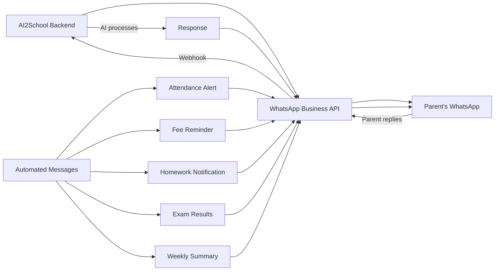

# Module 6: Parent Portal — Complete Design

---

## Overview

The Parent Portal is the primary interface for parents to engage with their child's school life. It is designed mobile-first (React Native app + PWA) with WhatsApp integration for parents who prefer lightweight interaction.

---

## 6.1 Feature Map

| Feature | Description | Data Source |
|---|---|---|
| **Attendance Tracking** | Daily attendance status, monthly calendar, leave application | Attendance Module |
| **Fee Tracking** | Pending fees, payment history, online payment, receipt download | Fee Module |
| **Homework Tracking** | Pending homework, submission status, grades | LMS Module |
| **Academic Performance** | Exam results, report cards, subject-wise trends | Exam Module |
| **AI Parent Assistant** | Chatbot for queries, weekly summaries, recommendations | AI Analytics |
| **School Communication** | Announcements, circulars, direct messaging to teacher | Communication Module |
| **Student Profile** | View/update student details, documents | SIS Module |
| **Timetable** | View class timetable | Timetable Module |
| **AI Tutor Monitor** | View child's AI tutor usage (topics, time — not conversations) | AI Tutor Module |

---

## 6.2 User Stories

| ID | As a Parent... | I want to... | So that... | Priority |
|---|---|---|---|---|
| PP-001 | View my child's attendance today and this month | I know if they reached school | P0 |
| PP-002 | Receive instant notification when my child is marked absent | I can take immediate action | P0 |
| PP-003 | Apply for leave on behalf of my child | leave management is digital | P1 |
| PP-004 | View pending fees and pay online (UPI/Card) | payment is convenient | P0 |
| PP-005 | View fee history and download receipts | I have financial records | P1 |
| PP-006 | See today's homework assignments | I can ensure my child completes them | P0 |
| PP-007 | View homework submission status and grades | I know if work was submitted and reviewed | P0 |
| PP-008 | View exam results and report cards online | I have immediate access to academic records | P0 |
| PP-009 | See subject-wise performance trends over time | I understand my child's progress | P1 |
| PP-010 | Read school announcements and circulars | I stay updated on school activities | P0 |
| PP-011 | Message my child's class teacher | I can communicate directly | P1 |
| PP-012 | Ask the AI assistant questions about my child's performance | I get quick, clear answers | P2 |
| PP-013 | Receive weekly AI-generated progress summary | I have an easy overview even if busy | P1 |
| PP-014 | View class timetable | I know what subjects are scheduled | P1 |
| PP-015 | View my child's AI tutor usage (subjects, time spent) | I can monitor screen time and focus areas | P2 |
| PP-016 | Acknowledge circulars and respond to school queries | the school knows I've read important notices | P1 |
| PP-017 | Switch between children if I have multiple kids in the school | I can track all my children in one app | P0 |

---

## 6.3 Screen Designs

### Home Screen (Dashboard)

```
┌─────────────────────────────────────────┐
│ ☰  AI2School Parent         🔔 (3)  👤│
├─────────────────────────────────────────┤
│                                         │
│  👧 Ananya Sharma                       │
│  Class 7-A  │  Roll No. 15    [Switch ▼]│
│                                         │
├─────────────────────────────────────────┤
│ TODAY                                   │
│ ┌─────────┐ ┌─────────┐ ┌─────────┐  │
│ │✅ Present│ │📝 2 HW  │ │💰 No    │  │
│ │Marked at │ │ pending │ │ dues    │  │
│ │ 8:15 AM  │ │         │ │         │  │
│ └─────────┘ └─────────┘ └─────────┘  │
├─────────────────────────────────────────┤
│ 🤖 AI INSIGHT                          │
│ ┌─────────────────────────────────────┐│
│ │ "Ananya scored 85/100 in Science   ││
│ │  Unit Test — up 12% from last test!││
│ │  She needs more practice in Hindi  ││
│ │  grammar. Tap for full report."    ││
│ └─────────────────────────────────────┘│
├─────────────────────────────────────────┤
│ RECENT UPDATES                          │
│ 📢 Annual Day rehearsals start Mon     │
│ 📝 Math homework due tomorrow          │
│ 📊 Unit Test 3 results published       │
│ 📅 PTM scheduled for June 20           │
├─────────────────────────────────────────┤
│                                         │
│  [📅]    [📝]    [📊]    [💰]    [💬] │
│  Attend  HWork   Grades  Fees    Chat  │
└─────────────────────────────────────────┘
```

### Attendance Screen

```
┌─────────────────────────────────────────┐
│ ← Attendance                     📅    │
├─────────────────────────────────────────┤
│ THIS MONTH: June 2025                   │
│ Attendance: 94% (16/17 days)            │
│                                         │
│  Mo  Tu  We  Th  Fr  Sa                │
│  ──  ──  ──  ──  ──  ──               │
│       1   2   3   4   5                │
│  [🟢][🟢][🔴][🟢][🟢][🟡]           │
│   8   9  10  11  12  13               │
│  [🟢][🟢][🟢][🟢][🟢][⬜]           │
│  15  16  17  18  19  20               │
│  [🟢][ ][ ][ ][ ][ ]                 │
│                                         │
│ 🟢 Present  🔴 Absent  🟡 Late  ⬜ Holiday│
│                                         │
│ [+ Apply for Leave]                     │
├─────────────────────────────────────────┤
│ MONTHLY SUMMARY                         │
│ ┌─────────┬─────────┬─────────┐       │
│ │Apr: 96% │May: 92% │Jun: 94% │       │
│ └─────────┴─────────┴─────────┘       │
└─────────────────────────────────────────┘
```

### Fee Payment Screen

```
┌─────────────────────────────────────────┐
│ ← Fees                                  │
├─────────────────────────────────────────┤
│ PENDING PAYMENTS                        │
│ ┌─────────────────────────────────────┐│
│ │ June 2025 Fee                       ││
│ │ Due: June 15, 2025                  ││
│ │                                     ││
│ │ Tuition Fee          ₹5,000        ││
│ │ Transport Fee        ₹2,000        ││
│ │ Lab Fee              ₹500          ││
│ │ ─────────────────────────────      ││
│ │ Total                ₹7,500        ││
│ │                                     ││
│ │ [Pay Now →]                         ││
│ └─────────────────────────────────────┘│
├─────────────────────────────────────────┤
│ PAYMENT HISTORY                         │
│ ┌─────────────────────────────────────┐│
│ │ ✅ May 2025  │ ₹7,500 │ Paid May 12││
│ │ ✅ Apr 2025  │ ₹7,500 │ Paid Apr 10││
│ │ ✅ Mar 2025  │ ₹7,500 │ Paid Mar 8 ││
│ └─────────────────────────────────────┘│
│                                         │
│ [📄 Download Fee Summary (PDF)]        │
└─────────────────────────────────────────┘
```

---

## 6.4 AI Parent Assistant

### Description
A conversational AI interface where parents can ask questions about their child's academic life and get instant, data-driven answers.

### Supported Query Types

| Query Type | Example | Response Source |
|---|---|---|
| **Performance** | "How is my child doing in Math?" | Exam marks, homework scores, mastery data |
| **Attendance** | "How many days was she absent this month?" | Attendance records |
| **Homework** | "Does she have any pending homework?" | LMS homework data |
| **Fees** | "How much fee is pending?" | Fee invoices |
| **Schedule** | "What subjects does she have tomorrow?" | Timetable |
| **Recommendations** | "What should she focus on for exams?" | AI Analytics + Study Planner |
| **Comparison** | "Is she improving in Science?" | Historical performance data |

### Prompt Design

```
SYSTEM PROMPT:
You are an AI assistant for school parents. You answer questions about their child's 
academic performance, attendance, fees, and school activities using verified data.

RULES:
- Only share information about the parent's own child — NEVER share other students' data
- Use simple, non-jargon language
- Be positive and encouraging, even when sharing areas of concern
- Always provide actionable suggestions
- If you don't have the data, say so clearly — don't fabricate
- Keep responses concise (under 100 words unless more detail is requested)
- For fee-related queries, always mention exact amounts and due dates
- For performance queries, reference specific exams and subjects
- If asked about AI tutor usage, share topics and time — NOT conversation content

CHILD DATA:
{student_profile}
{recent_attendance}
{recent_exam_results}
{pending_homework}
{fee_status}
{timetable}
{ai_tutor_summary}

PARENT QUERY: {query}
```

### Guardrails

| Rule | Description |
|---|---|
| **Data Privacy** | AI only accesses data for the authenticated parent's child |
| **No Comparison** | Never compares child with other students ("Your child is better/worse than...") |
| **Positive Framing** | Frame weaknesses as "areas for growth" with specific suggestions |
| **No Medical/Psychological Advice** | Redirect to school counselor for non-academic concerns |
| **Scope Limitation** | Only answers school-related queries; politely declines other topics |

---

## 6.5 WhatsApp Integration

### Why WhatsApp
- 95%+ parents in India use WhatsApp
- No app installation required
- Works on basic smartphones
- Higher message read rates than SMS or email

### Integration Architecture



### WhatsApp Message Templates

#### Attendance Alert
```
🏫 AI2School - Attendance Alert

Dear Parent,
Your child *{student_name}* (Class {grade}-{section}) 
was marked *absent* today ({date}).

If this is unexpected, please contact the school.
To apply for leave, reply LEAVE.

— {school_name}
```

#### Fee Reminder
```
🏫 AI2School - Fee Reminder

Dear Parent,
Fee for *{month}* is pending for *{student_name}*.

Amount: ₹{amount}
Due Date: {due_date}

Pay online: {payment_link}
Or reply FEE for details.

— {school_name}
```

#### Weekly AI Summary
```
📊 Weekly Report: {student_name} (Class {grade}-{section})
Week: {date_range}

✅ Attendance: {attendance_days}/{total_days} ({attendance_pct}%)
📝 Homework: {hw_completed}/{hw_total} submitted
🏆 Best Score: {best_subject} - {best_score}

💡 AI Tip: {recommendation}

Reply DETAIL for full report.
— {school_name}
```

### Interactive Replies

| Parent Sends | Bot Responds |
|---|---|
| HI | Welcome menu with options |
| ATTENDANCE | Today's status + monthly summary |
| HOMEWORK | List of pending homework |
| FEES | Fee status + payment link |
| RESULTS | Latest exam results |
| LEAVE | Leave application form (guided) |
| DETAIL | Detailed weekly report |
| HELP | List of available commands |

---

## 6.6 Parent Portal API Endpoints

```
# Dashboard
GET    /api/v1/parent/dashboard/{studentId}          # Parent dashboard data

# Attendance
GET    /api/v1/parent/attendance/{studentId}          # Attendance calendar
POST   /api/v1/parent/attendance/{studentId}/leave    # Apply for leave

# Fees
GET    /api/v1/parent/fees/{studentId}                # Fee status
GET    /api/v1/parent/fees/{studentId}/history        # Payment history
POST   /api/v1/parent/fees/{studentId}/pay             # Initiate payment
GET    /api/v1/parent/fees/{studentId}/receipt/{payId}  # Download receipt

# Homework
GET    /api/v1/parent/homework/{studentId}            # Homework list
GET    /api/v1/parent/homework/{studentId}/pending     # Pending homework

# Academics
GET    /api/v1/parent/academics/{studentId}/results    # Exam results
GET    /api/v1/parent/academics/{studentId}/report-card/{examId}  # Report card
GET    /api/v1/parent/academics/{studentId}/trends     # Performance trends

# Communication
GET    /api/v1/parent/messages                         # Messages from school
POST   /api/v1/parent/messages                         # Send message to teacher
GET    /api/v1/parent/circulars                        # School circulars
POST   /api/v1/parent/circulars/{id}/acknowledge       # Acknowledge circular

# Timetable
GET    /api/v1/parent/timetable/{studentId}            # Class timetable

# AI
POST   /api/v1/parent/ai-assistant                     # Chat with AI assistant
GET    /api/v1/parent/ai-tutor-usage/{studentId}       # AI tutor usage stats
GET    /api/v1/parent/weekly-summary/{studentId}        # Weekly AI summary

# Profile
GET    /api/v1/parent/children                         # List linked children
GET    /api/v1/parent/profile/{studentId}               # Student profile view
PUT    /api/v1/parent/profile/{studentId}               # Update student info

# Notifications
GET    /api/v1/parent/notifications                    # Notification history
PUT    /api/v1/parent/notifications/preferences         # Notification preferences
```

---

*Next: [AI Architecture & Curriculum Intelligence →](./08-ai-architecture.md)*
