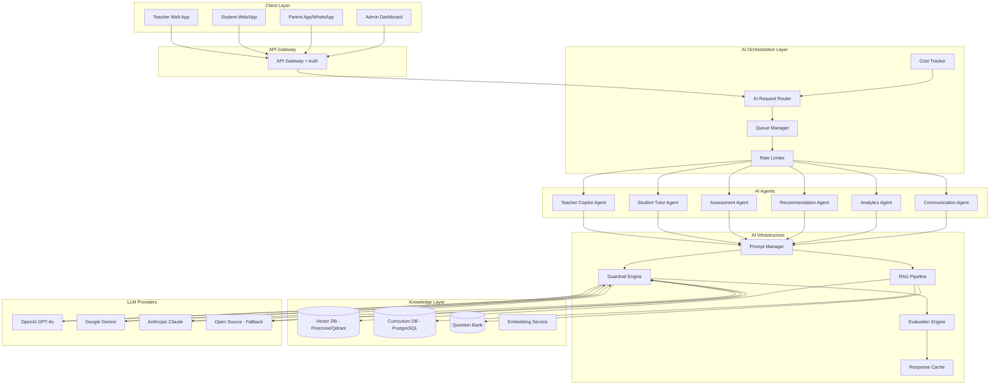
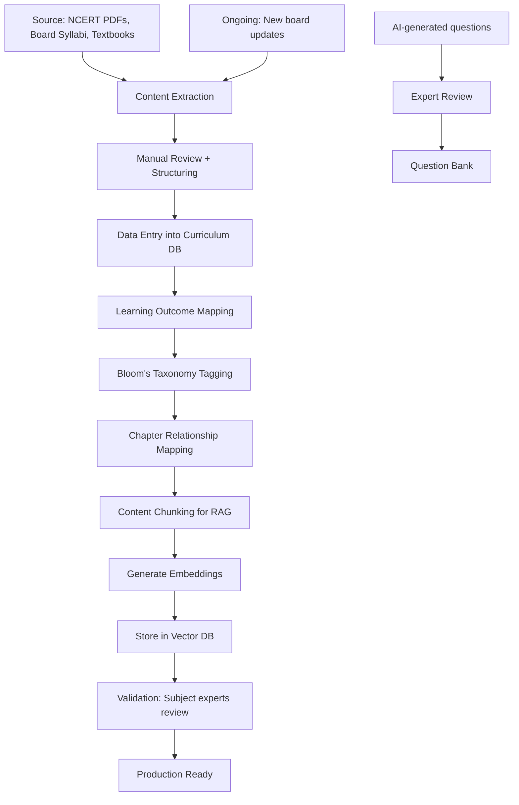
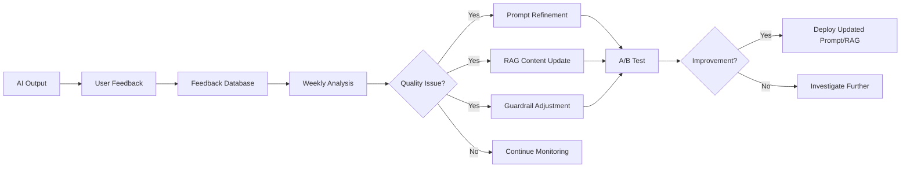

# AI Architecture, Curriculum Intelligence & RAG Design

---

## 1. AI Agent Architecture

### System Overview



---

## 2. Agent Definitions

### Agent 1: Teacher Copilot Agent

| Attribute | Detail |
|---|---|
| **Responsibilities** | Lesson plan generation, test paper generation, worksheet generation, homework generation, report card comments, parent message drafting |
| **Inputs** | Teacher request + curriculum context (board, grade, subject, chapter) + school configuration (templates, grading) + student data (for personalization) |
| **Outputs** | Structured documents: lesson plans (JSON), question papers (JSON→PDF), worksheets (JSON→PDF), comments (text), messages (text) |
| **Primary LLM** | GPT-4o (quality-critical) with Gemini 1.5 Flash as fallback for simpler tasks |
| **RAG Required** | Yes — curriculum content, textbook material, previous question papers, learning outcomes |
| **Latency Target** | <15s for lesson plans, <20s for full question paper, <5s for comments |
| **Quality Metrics** | Teacher acceptance rate (% of AI outputs used without heavy editing), Curriculum alignment score, Bloom's taxonomy accuracy |

#### Prompt Templates (Core)

**Lesson Plan Generation**
```
[System] You are an expert K-12 curriculum planner for {board} Board schools in India...
[Context] Chapter: {chapter_content_from_rag}
         Learning Outcomes: {outcomes}
         School Template: {school_template}
[User] Generate a {plan_type} lesson plan for Grade {grade}, {subject}, Chapter: {chapter}...
[Output Schema] {json_schema}
```

**Test Paper Generation**
```
[System] You are an expert question paper setter...
[Context] Chapters: {chapter_contents}
         Board Pattern: {board_pattern}
         Previous Papers: {previous_hashes_to_avoid}
[User] Generate a question paper with: {parameters}
[Output Schema] {json_schema}
[Validation] Total marks must equal {total_marks}. Distribution: {difficulty_mix}
```

---

### Agent 2: Student Tutor Agent

| Attribute | Detail |
|---|---|
| **Responsibilities** | Concept explanation (6 modes), doubt solving, quiz generation, adaptive practice, study planning, revision material, exam prep |
| **Inputs** | Student query + student profile (grade, board, mastery level) + curriculum context + session history |
| **Outputs** | Explanations (markdown), solutions (step-by-step), quizzes (JSON), study plans (structured), flashcards |
| **Primary LLM** | Gemini 1.5 Flash (speed + cost efficiency for high-volume student interactions) with GPT-4o for complex explanations |
| **RAG Required** | Yes — textbook content, solved examples, formulas, diagrams |
| **Latency Target** | <3s for explanations, <2s for quiz questions, <5s for doubt solutions |
| **Quality Metrics** | Student satisfaction (thumbs up/down), factual accuracy (% correct answers), concept coverage (vs. curriculum), re-query rate (lower is better) |

#### Safety Layers
```
Input Filtering → Topic Classification → Curriculum Scope Check → 
LLM Generation → Output Validation → Content Safety Filter → 
Factual Accuracy Check → Response Delivery
```

---

### Agent 3: Assessment Agent

| Attribute | Detail |
|---|---|
| **Responsibilities** | Question generation, answer evaluation, marking scheme creation, question quality analysis, item discrimination analysis |
| **Inputs** | Assessment parameters + curriculum content + student answers (for evaluation) |
| **Outputs** | Questions (structured), evaluations (scores + feedback), analytics |
| **Primary LLM** | GPT-4o (accuracy-critical for evaluation) |
| **RAG Required** | Yes — question banks, textbook exercises, board paper patterns |
| **Quality Metrics** | Answer evaluation accuracy (vs. teacher grading), question difficulty calibration accuracy |

---

### Agent 4: Recommendation Agent

| Attribute | Detail |
|---|---|
| **Responsibilities** | Learning path recommendations, study focus suggestions, resource suggestions, intervention recommendations |
| **Inputs** | Student performance data, mastery scores, attendance, homework data, engagement metrics |
| **Outputs** | Prioritized recommendations with rationale |
| **Primary LLM** | Gemini 1.5 Flash (data analysis + reasoning) |
| **RAG Required** | Minimal — primarily works on structured data |
| **Quality Metrics** | Recommendation relevance (teacher/parent rating), student improvement after following recommendations |

---

### Agent 5: Analytics Agent

| Attribute | Detail |
|---|---|
| **Responsibilities** | Insight generation, at-risk student detection, trend analysis, cross-section comparisons, predictive analytics |
| **Inputs** | Aggregated school data: marks, attendance, fees, engagement |
| **Outputs** | Natural language insights, risk scores, predictions |
| **Primary LLM** | Gemini 1.5 Pro (long context for data analysis) |
| **RAG Required** | No — works on structured data |
| **Quality Metrics** | Prediction accuracy (at-risk → actual outcome), insight actionability (% acted upon) |

---

### Agent 6: Communication Agent

| Attribute | Detail |
|---|---|
| **Responsibilities** | Parent message drafting, announcement writing, circular generation, automated notification personalization |
| **Inputs** | Communication purpose + audience + context data |
| **Outputs** | Message text (multi-channel formatted: SMS, WhatsApp, Email) |
| **Primary LLM** | Gemini 1.5 Flash (fast, cost-effective) |
| **RAG Required** | No |
| **Quality Metrics** | Teacher acceptance rate, parent response rate, message clarity score |

---

## 3. Curriculum Intelligence System

### Overview
The Curriculum Intelligence Engine is a structured knowledge system that provides curriculum-aware context to all AI agents. It is NOT an AI itself — it is a relational + vector database that stores and serves curriculum data.

### Supported Boards

| Board | Coverage | Priority |
|---|---|---|
| **CBSE** | Classes 1-12, all subjects | P0 (Launch) |
| **ICSE / ISC** | Classes 1-12, all subjects | P1 (Month 4) |
| **State Boards** | Maharashtra, Karnataka, Tamil Nadu, UP (prioritized) | P2 (Month 7+) |
| **International** | IGCSE, IB (MYP + DP) | P3 (Month 10+) |

### Curriculum Data Model

```sql
-- Boards
CREATE TABLE curriculum_boards (
    id UUID PRIMARY KEY DEFAULT gen_random_uuid(),
    name VARCHAR(100) NOT NULL,       -- "CBSE", "ICSE", "Maharashtra State Board"
    code VARCHAR(20) UNIQUE NOT NULL, -- "cbse", "icse", "mah_state"
    country VARCHAR(50) DEFAULT 'India',
    description TEXT,
    is_active BOOLEAN DEFAULT TRUE,
    created_at TIMESTAMP DEFAULT NOW()
);

-- Grades (board-specific naming)
CREATE TABLE curriculum_grades (
    id UUID PRIMARY KEY DEFAULT gen_random_uuid(),
    board_id UUID NOT NULL REFERENCES curriculum_boards(id),
    grade_number INTEGER NOT NULL,   -- 1-12
    name VARCHAR(50) NOT NULL,       -- "Class 1", "Grade 1", "Standard 1"
    stage VARCHAR(30),               -- primary, middle, secondary, sr_secondary
    created_at TIMESTAMP DEFAULT NOW(),
    UNIQUE(board_id, grade_number)
);

-- Subjects
CREATE TABLE curriculum_subjects (
    id UUID PRIMARY KEY DEFAULT gen_random_uuid(),
    board_id UUID NOT NULL REFERENCES curriculum_boards(id),
    name VARCHAR(100) NOT NULL,         -- "Mathematics", "Science", "Physics"
    code VARCHAR(30) NOT NULL,
    grade_ids UUID[] NOT NULL,           -- Applicable grades
    is_elective BOOLEAN DEFAULT FALSE,
    subject_group VARCHAR(50),           -- science, arts, commerce, language
    created_at TIMESTAMP DEFAULT NOW()
);

-- Chapters / Units
CREATE TABLE curriculum_chapters (
    id UUID PRIMARY KEY DEFAULT gen_random_uuid(),
    subject_id UUID NOT NULL REFERENCES curriculum_subjects(id),
    grade_id UUID NOT NULL REFERENCES curriculum_grades(id),
    chapter_number INTEGER NOT NULL,
    name VARCHAR(255) NOT NULL,
    description TEXT,
    estimated_periods INTEGER,           -- How many periods to cover
    weightage_percentage DECIMAL(5,2),   -- Weightage in board exam
    
    -- Content
    key_concepts TEXT[],
    formulas JSONB,                      -- [{formula, description, variables}]
    key_terms JSONB,                     -- [{term, definition}]
    
    -- Relationships
    prerequisite_chapter_ids UUID[],     -- Previous chapters needed
    related_chapter_ids UUID[],          -- Related chapters in same/other subjects
    
    created_at TIMESTAMP DEFAULT NOW(),
    UNIQUE(subject_id, grade_id, chapter_number)
);

-- Learning Outcomes (per chapter)
CREATE TABLE learning_outcomes (
    id UUID PRIMARY KEY DEFAULT gen_random_uuid(),
    chapter_id UUID NOT NULL REFERENCES curriculum_chapters(id),
    outcome_code VARCHAR(30),            -- LO1, LO2, etc.
    description TEXT NOT NULL,
    blooms_level VARCHAR(20) NOT NULL,   -- remember, understand, apply, analyze, evaluate, create
    cognitive_domain VARCHAR(30),        -- knowledge, comprehension, application, analysis, synthesis, evaluation
    
    -- For assessment mapping
    suggested_question_types TEXT[],     -- ["mcq", "short_answer", "diagram"]
    suggested_marks INTEGER,
    
    created_at TIMESTAMP DEFAULT NOW()
);

-- Question Bank (curated + AI-generated)
CREATE TABLE question_bank (
    id UUID PRIMARY KEY DEFAULT gen_random_uuid(),
    board_id UUID NOT NULL REFERENCES curriculum_boards(id),
    grade_id UUID NOT NULL REFERENCES curriculum_grades(id),
    subject_id UUID NOT NULL REFERENCES curriculum_subjects(id),
    chapter_id UUID NOT NULL REFERENCES curriculum_chapters(id),
    learning_outcome_id UUID REFERENCES learning_outcomes(id),
    
    question_text TEXT NOT NULL,
    question_type VARCHAR(30) NOT NULL,  -- mcq, short_answer, long_answer, fill_blank, true_false, match, diagram, case_study
    options JSONB,                        -- For MCQ: [{text, is_correct}]
    answer TEXT NOT NULL,
    explanation TEXT,
    marking_scheme TEXT,
    
    difficulty VARCHAR(10) NOT NULL,     -- easy, medium, hard
    blooms_level VARCHAR(20) NOT NULL,
    marks INTEGER NOT NULL,
    
    source VARCHAR(30),                  -- curated, ai_generated, board_paper
    source_year INTEGER,                 -- For board paper questions
    verified BOOLEAN DEFAULT FALSE,
    verified_by UUID REFERENCES users(id),
    
    usage_count INTEGER DEFAULT 0,       -- Times used in generated papers
    
    -- Embeddings for similarity search
    embedding_id VARCHAR(100),           -- Reference to vector DB
    
    tags TEXT[],
    created_at TIMESTAMP DEFAULT NOW(),
    updated_at TIMESTAMP DEFAULT NOW()
);

CREATE INDEX idx_question_bank_chapter ON question_bank(chapter_id, difficulty, blooms_level);
CREATE INDEX idx_question_bank_subject ON question_bank(subject_id, grade_id, question_type);

-- Textbook Content (for RAG)
CREATE TABLE textbook_content (
    id UUID PRIMARY KEY DEFAULT gen_random_uuid(),
    board_id UUID NOT NULL REFERENCES curriculum_boards(id),
    grade_id UUID NOT NULL REFERENCES curriculum_grades(id),
    subject_id UUID NOT NULL REFERENCES curriculum_subjects(id),
    chapter_id UUID NOT NULL REFERENCES curriculum_chapters(id),
    
    content_type VARCHAR(30),            -- text, example, exercise, diagram_description, formula, activity
    section_title VARCHAR(255),
    content TEXT NOT NULL,
    page_reference VARCHAR(30),          -- e.g., "NCERT p.45"
    
    -- For RAG chunking
    chunk_index INTEGER,                 -- Order within chapter
    parent_chunk_id UUID REFERENCES textbook_content(id),
    
    -- Vector embedding reference
    embedding_id VARCHAR(100),
    
    created_at TIMESTAMP DEFAULT NOW()
);
```

### Curriculum Data Pipeline



---

## 4. RAG Architecture

### Overview
RAG (Retrieval-Augmented Generation) grounds all AI outputs in actual curriculum content, preventing hallucinations and ensuring accuracy.

### Architecture

```mermaid
flowchart LR
    subgraph "Query Processing"
        Q[User Query] --> QP[Query Preprocessor]
        QP --> QC[Query Classifier]
        QC --> QE[Query Embedder]
        QC --> MD[Metadata Filter Builder]
    end

    subgraph "Retrieval"
        QE --> VS[Vector Search - Semantic]
        MD --> KS[Keyword Search - Lexical]
        VS --> RR[Reciprocal Rank Fusion]
        KS --> RR
        RR --> RE[Re-ranker - Cross-Encoder]
        RE --> TOP[Top-K Results]
    end

    subgraph "Augmentation"
        TOP --> CC[Context Compiler]
        CC --> PC[Prompt Constructor]
        PC --> LLM[LLM Generation]
    end

    subgraph "Validation"
        LLM --> FV[Factual Validator]
        FV --> SA[Source Attribution]
        SA --> HF[Hallucination Filter]
        HF --> OUT[Final Response]
    end
```



### Knowledge Base Structure

| Source | Content Type | Update Frequency | Priority |
|---|---|---|---|
| NCERT Textbooks | Chapter content, examples, exercises | Annually | P0 |
| Board Syllabi | Learning outcomes, weightages | Annually | P0 |
| Reference Books | Additional explanations, solved examples | As available | P1 |
| Previous Board Papers | Questions, patterns, trends | Annually | P1 |
| School Question Banks | Curated questions | Ongoing | P1 |
| Teacher-Created Content | Lesson plans, worksheets (approved) | Ongoing | P2 |

### Embedding Strategy

```python
# Embedding Configuration
EMBEDDING_CONFIG = {
    "model": "text-embedding-3-small",  # OpenAI (or "models/embedding-001" for Gemini)
    "dimensions": 1536,
    "chunk_size": 512,       # tokens per chunk
    "chunk_overlap": 64,     # overlapping tokens between chunks
    "batch_size": 100,       # embeddings per API call
}

# Chunking Strategy
def chunk_curriculum_content(chapter):
    chunks = []
    
    # Strategy 1: Section-based chunking (primary)
    for section in chapter.sections:
        if len(section.tokens) <= CHUNK_SIZE:
            chunks.append(create_chunk(section, "section"))
        else:
            # Split long sections with overlap
            for sub_chunk in split_with_overlap(section):
                chunks.append(create_chunk(sub_chunk, "sub_section"))
    
    # Strategy 2: Concept-based chunking (supplementary)
    for concept in chapter.key_concepts:
        chunks.append(create_chunk(concept, "concept"))
    
    # Strategy 3: Formula chunks (standalone)
    for formula in chapter.formulas:
        chunks.append(create_chunk(formula, "formula"))
    
    # Strategy 4: Q&A pairs (from exercises)
    for qa in chapter.exercises:
        chunks.append(create_chunk(qa, "question_answer"))
    
    return chunks

def create_chunk(content, chunk_type):
    return {
        "text": content.text,
        "metadata": {
            "board": content.board,
            "grade": content.grade,
            "subject": content.subject,
            "chapter_id": content.chapter_id,
            "chapter_name": content.chapter_name,
            "chunk_type": chunk_type,
            "learning_outcomes": content.mapped_outcomes,
            "page_reference": content.page_ref,
        },
        "embedding": generate_embedding(content.text)
    }
```

### Vector Database Design

**Choice: Qdrant (self-hosted) or Pinecone (managed)**

```
Collection: curriculum_content
├── Dimensions: 1536
├── Distance: Cosine
├── Indexes:
│   ├── board_id (keyword)
│   ├── grade_number (integer)
│   ├── subject_code (keyword)
│   ├── chapter_id (keyword)
│   └── chunk_type (keyword)
└── Payload: metadata (board, grade, subject, chapter, page_ref, etc.)
```

### Retrieval Pipeline

```python
async def retrieve_context(query, student_context):
    # Step 1: Classify query intent
    intent = classify_query(query)  # explain, doubt, generate_quiz, etc.
    
    # Step 2: Build metadata filters
    filters = {
        "board": student_context.board,
        "grade": student_context.grade,
        "subject": student_context.subject,
    }
    if student_context.chapter:
        filters["chapter_id"] = student_context.chapter_id
    
    # Step 3: Semantic search
    query_embedding = await embed(query)
    semantic_results = vector_db.search(
        vector=query_embedding,
        filter=filters,
        limit=10,
        score_threshold=0.7
    )
    
    # Step 4: Keyword search (BM25)
    keyword_results = keyword_index.search(
        query=query,
        filter=filters,
        limit=10
    )
    
    # Step 5: Reciprocal Rank Fusion
    fused_results = reciprocal_rank_fusion(
        semantic_results, 
        keyword_results,
        k=60
    )
    
    # Step 6: Re-ranking with cross-encoder
    reranked = cross_encoder_rerank(
        query=query,
        documents=fused_results[:20],
        model="cross-encoder/ms-marco-MiniLM-L-6-v2"
    )
    
    # Step 7: Select top-K with diversity
    top_k = select_diverse_top_k(reranked, k=5)
    
    return top_k
```

### Hallucination Prevention

| Strategy | Implementation |
|---|---|
| **Source Grounding** | Every factual claim must be traceable to a retrieved chunk |
| **Confidence Scoring** | LLM outputs a confidence score (0-1) for each response |
| **Low-Confidence Flagging** | Responses with confidence <0.7 are flagged for human review |
| **Forbidden Phrases** | System blocks "I think", "probably", "might be" for factual content |
| **Cross-Reference Validation** | For critical content (exam answers), validate against multiple sources |
| **Student Feedback Loop** | "Was this helpful?" + "Was this accurate?" signals |
| **Teacher Verification** | AI-generated exam content requires teacher approval |

### Source Attribution

```json
{
  "response": "Photosynthesis is the process by which...",
  "sources": [
    {
      "text": "Photosynthesis is the process by which green plants...",
      "source": "NCERT Science Class 7, Chapter 1, Page 3",
      "relevance_score": 0.94,
      "chunk_id": "chunk_abc123"
    },
    {
      "text": "The equation for photosynthesis is: 6CO₂ + 6H₂O → C₆H₁₂O₆ + 6O₂",
      "source": "NCERT Science Class 7, Chapter 1, Page 5",
      "relevance_score": 0.91,
      "chunk_id": "chunk_def456"
    }
  ],
  "confidence": 0.95,
  "grounded": true
}
```

---

## 5. AI Evaluation Framework

### Quality Metrics by Agent

| Agent | Metric | Target | Measurement |
|---|---|---|---|
| Teacher Copilot | Acceptance Rate | >80% | % of outputs used without major edits |
| Teacher Copilot | Curriculum Alignment | >95% | Automated check against curriculum DB |
| Student Tutor | Factual Accuracy | >98% | Spot-check + student/teacher feedback |
| Student Tutor | Student Satisfaction | >4.2/5 | In-app rating |
| Assessment Agent | Question Quality | >85% good | Discrimination index analysis |
| Analytics Agent | Prediction Accuracy | >80% | At-risk → actual outcome correlation |
| Communication Agent | Parent Engagement | >60% response | Message read/action rate |
| All Agents | Latency | <5s (avg) | P95 latency monitoring |
| All Agents | Safety | 0 incidents | Content filter catch rate |

### Continuous Improvement Pipeline



---

## 6. LLM Provider Strategy

### Multi-Provider Approach

| Use Case | Primary | Fallback | Reasoning |
|---|---|---|---|
| Lesson Plans | GPT-4o | Gemini 1.5 Pro | High quality structured output needed |
| Question Papers | GPT-4o | Claude 3.5 Sonnet | Accuracy-critical, needs strong reasoning |
| Report Card Comments | Gemini 1.5 Flash | GPT-4o-mini | Volume task, cost-sensitive |
| Student Explanations | Gemini 1.5 Flash | GPT-4o-mini | Low latency needed, high volume |
| Doubt Solving | GPT-4o | Gemini 1.5 Pro | Accuracy + step-by-step reasoning |
| Analytics Insights | Gemini 1.5 Pro | GPT-4o | Long context data analysis |
| Communication Drafts | Gemini 1.5 Flash | GPT-4o-mini | Simple, high volume |

### Cost Optimization

```python
COST_PER_1K_TOKENS = {
    "gpt-4o": {"input": 0.005, "output": 0.015},
    "gpt-4o-mini": {"input": 0.00015, "output": 0.0006},
    "gemini-1.5-flash": {"input": 0.000075, "output": 0.0003},
    "gemini-1.5-pro": {"input": 0.00125, "output": 0.005},
}

# Monthly cost estimate (per 1000-student school)
MONTHLY_ESTIMATES = {
    "teacher_copilot": "$50-100",     # ~10 teachers × 20 uses/month
    "student_tutor": "$200-400",       # ~500 active students × 30 sessions/month  
    "analytics": "$20-50",             # Batch processing, weekly
    "communication": "$10-20",         # Automated messages
    "total_per_school": "$280-570/month"
}
```

### Caching Strategy

```python
# Cache AI responses to reduce costs and latency
CACHE_RULES = {
    "lesson_plan": {
        "cache_key": hash(board, grade, subject, chapter, plan_type, method),
        "ttl": "7 days",
        "personalize": False,  # Same plan works for multiple teachers
    },
    "explanation": {
        "cache_key": hash(board, grade, subject, topic, mode),
        "ttl": "30 days",
        "personalize": False,  # Explanations are grade-level, not student-specific
    },
    "quiz_question": {
        "cache_key": hash(chapter, difficulty, blooms, question_type),
        "ttl": "30 days",
        "personalize": False,
    },
    "report_comment": {
        "cache_key": None,     # Always personalized
        "ttl": None,
        "personalize": True,
    },
    "study_plan": {
        "cache_key": None,     # Always personalized
        "ttl": None,
        "personalize": True,
    }
}
```

---

*Next: [Technical Architecture & Data Model →](./09-technical-architecture.md)*
