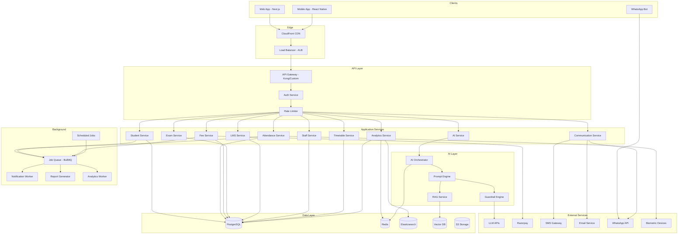

# Technical Architecture, Data Model, API Design & Security

---

## 1. Tech Stack (with Justification)

### Recommended Stack

| Layer | Technology | Justification |
|---|---|---|
| **Frontend (Web)** | Next.js 14 (React) + TypeScript | SSR for SEO, App Router, excellent DX, large ecosystem. Teachers and admins use web. |
| **Frontend (Mobile)** | React Native + Expo | Cross-platform (iOS + Android) for parent app. Code sharing with web via shared libraries. |
| **UI Framework** | Shadcn/ui + Tailwind CSS | Beautiful, accessible components. Customizable. Fast development. |
| **State Management** | Zustand + TanStack Query | Lightweight, type-safe state. TanStack Query for server state caching. |
| **Backend** | Node.js (NestJS) + TypeScript | Type safety end-to-end, excellent for REST + WebSocket, modular architecture. |
| **API Style** | REST (primary) + WebSocket (real-time) | REST for CRUD, WebSocket for notifications and real-time features. |
| **Database** | PostgreSQL 16 | Best relational DB. JSONB for flexible schemas, excellent indexing, mature multi-tenant patterns. |
| **ORM** | Prisma | Type-safe, great migration system, good with NestJS. |
| **Caching** | Redis 7 | Session management, API rate limiting, AI response caching, real-time pubsub. |
| **Search** | Elasticsearch (or Meilisearch) | Full-text search across students, content, questions. Fast, faceted. |
| **Vector Database** | Qdrant (self-hosted) or Pinecone (managed) | Curriculum content embeddings for RAG. Qdrant for cost control; Pinecone for managed simplicity. |
| **LLM Providers** | OpenAI GPT-4o + Google Gemini 1.5 | Multi-provider for quality, cost, and reliability. See AI Architecture for routing. |
| **File Storage** | AWS S3 / Google Cloud Storage | Documents, assignments, content library. CDN-backed for fast delivery. |
| **Message Queue** | BullMQ (Redis-based) | Async job processing: notifications, report generation, analytics, AI tasks. |
| **Email** | AWS SES or SendGrid | Transactional emails, bulk communications. |
| **SMS** | MSG91 or Twilio | Indian SMS gateway. OTP, attendance alerts, fee reminders. |
| **WhatsApp** | WhatsApp Business API (via Gupshup/Interakt) | Parent communication, chatbot. |
| **Push Notifications** | Firebase Cloud Messaging (FCM) | Mobile push for parent app. |
| **Payment Gateway** | Razorpay | UPI, Cards, Net Banking. Best for Indian education market. Auto-debit support. |
| **Authentication** | JWT + Refresh Tokens + OTP | Standard auth with phone-based OTP for parents. |
| **PDF Generation** | Puppeteer or React-PDF | Report cards, question papers, receipts. |
| **Cloud** | AWS (primary) or GCP | AWS for breadth of services; GCP if Google AI preferred. |
| **CI/CD** | GitHub Actions | Automated testing, building, deployment. |
| **Monitoring** | Datadog or Grafana + Prometheus | APM, logging, alerting. |
| **Error Tracking** | Sentry | Frontend + backend error tracking. |

---

## 2. System Architecture



---

## 3. Complete Entity-Relationship Diagram

```mermaid
erDiagram
    SCHOOLS ||--o{ ACADEMIC_YEARS : has
    SCHOOLS ||--o{ GRADES : configures
    SCHOOLS ||--o{ STAFF : employs
    SCHOOLS ||--o{ STUDENTS : enrolls
    SCHOOLS ||--o{ FEE_STRUCTURES : defines
    SCHOOLS ||--o{ ROOMS : has
    SCHOOLS ||--o{ MESSAGES : sends

    ACADEMIC_YEARS ||--o{ SECTIONS : organizes
    GRADES ||--o{ SECTIONS : has
    GRADES ||--o{ SUBJECTS : teaches

    STUDENTS ||--o{ STUDENT_PARENTS : has
    PARENTS ||--o{ STUDENT_PARENTS : has
    STUDENTS ||--o{ STUDENT_ATTENDANCE : tracked
    STUDENTS ||--o{ STUDENT_MARKS : scores
    STUDENTS ||--o{ FEE_INVOICES : billed
    STUDENTS ||--o{ HOMEWORK_SUBMISSIONS : submits
    STUDENTS ||--o{ AI_TUTOR_SESSIONS : uses
    STUDENTS ||--o{ AI_QUIZ_SESSIONS : takes
    STUDENTS ||--o{ STUDENT_MASTERY : measured

    STAFF ||--o{ TIMETABLE_ENTRIES : teaches
    STAFF ||--o{ LEAVE_APPLICATIONS : applies
    STAFF ||--o{ LESSON_PLANS : creates
    STAFF ||--o{ HOMEWORK : assigns
    STAFF ||--o{ TEACHER_ATTENDANCE : tracked

    EXAMS ||--o{ EXAM_SCHEDULES : contains
    EXAM_SCHEDULES ||--o{ STUDENT_MARKS : records
    EXAMS ||--o{ REPORT_CARD_COMMENTS : generates

    SUBJECTS ||--o{ CURRICULUM_CHAPTERS : organized_into
    CURRICULUM_CHAPTERS ||--o{ LEARNING_OUTCOMES : defines
    CURRICULUM_CHAPTERS ||--o{ QUESTION_BANK : sources
    CURRICULUM_CHAPTERS ||--o{ TEXTBOOK_CONTENT : contains

    FEE_STRUCTURES ||--o{ FEE_STRUCTURE_ITEMS : itemizes
    FEE_INVOICES ||--o{ FEE_INVOICE_ITEMS : contains
    FEE_INVOICES ||--o{ FEE_PAYMENTS : paid_via

    HOMEWORK ||--o{ HOMEWORK_SUBMISSIONS : receives

    USERS ||--o{ AUDIT_LOGS : generates

    SCHOOLS {
        uuid id PK
        string name
        string code
        string board
        jsonb address
        jsonb config
    }

    STUDENTS {
        uuid id PK
        uuid school_id FK
        string admission_number
        string first_name
        string last_name
        date date_of_birth
        uuid current_grade_id FK
        uuid current_section_id FK
    }

    STAFF {
        uuid id PK
        uuid school_id FK
        string employee_id
        string designation
        string department
    }

    PARENTS {
        uuid id PK
        uuid user_id FK
        string phone
        string relation_type
    }

    USERS {
        uuid id PK
        uuid school_id FK
        string email
        string phone
        string role
        uuid entity_id
    }
```



---

## 4. Core Database Schema (Foundation Tables)

```sql
-- ============================================
-- FOUNDATION TABLES
-- ============================================

-- Multi-Tenant: Schools (Tenants)
CREATE TABLE schools (
    id UUID PRIMARY KEY DEFAULT gen_random_uuid(),
    name VARCHAR(255) NOT NULL,
    code VARCHAR(50) UNIQUE NOT NULL,
    school_type VARCHAR(30), -- primary, secondary, k12, sr_secondary
    board_id UUID REFERENCES curriculum_boards(id),
    
    -- Contact
    email VARCHAR(255),
    phone VARCHAR(15),
    website VARCHAR(255),
    
    -- Address
    address_line1 TEXT,
    address_line2 TEXT,
    city VARCHAR(100),
    state VARCHAR(100),
    pincode VARCHAR(10),
    country VARCHAR(50) DEFAULT 'India',
    
    -- Branding
    logo_url TEXT,
    primary_color VARCHAR(7), -- Hex color
    
    -- Configuration
    config JSONB DEFAULT '{}',
    -- {
    --   "grading_system_id": "...",
    --   "attendance_type": "daily" | "period_wise",
    --   "sms_enabled": true,
    --   "whatsapp_enabled": true,
    --   "ai_features_enabled": true,
    --   "timezone": "Asia/Kolkata",
    --   "academic_start_month": 4
    -- }
    
    -- Subscription
    plan VARCHAR(20) DEFAULT 'starter', -- starter, growth, enterprise
    subscription_status VARCHAR(20) DEFAULT 'active',
    max_students INTEGER,
    
    -- Group (for multi-school)
    group_id UUID REFERENCES school_groups(id),
    
    status VARCHAR(20) DEFAULT 'active',
    created_at TIMESTAMP DEFAULT NOW(),
    updated_at TIMESTAMP DEFAULT NOW()
);

-- School Groups (for franchise/chain)
CREATE TABLE school_groups (
    id UUID PRIMARY KEY DEFAULT gen_random_uuid(),
    name VARCHAR(255) NOT NULL,
    code VARCHAR(50) UNIQUE NOT NULL,
    admin_email VARCHAR(255),
    config JSONB DEFAULT '{}',
    created_at TIMESTAMP DEFAULT NOW()
);

-- Academic Years
CREATE TABLE academic_years (
    id UUID PRIMARY KEY DEFAULT gen_random_uuid(),
    school_id UUID NOT NULL REFERENCES schools(id),
    name VARCHAR(50) NOT NULL, -- "2025-26"
    start_date DATE NOT NULL,
    end_date DATE NOT NULL,
    is_current BOOLEAN DEFAULT FALSE,
    status VARCHAR(20) DEFAULT 'active',
    created_at TIMESTAMP DEFAULT NOW(),
    
    UNIQUE(school_id, name)
);

-- Grades (School-specific configuration)
CREATE TABLE grades (
    id UUID PRIMARY KEY DEFAULT gen_random_uuid(),
    school_id UUID NOT NULL REFERENCES schools(id),
    curriculum_grade_id UUID REFERENCES curriculum_grades(id),
    name VARCHAR(50) NOT NULL, -- "Class 1", "Grade 1"
    grade_number INTEGER NOT NULL,
    stage VARCHAR(30), -- primary, middle, secondary, sr_secondary
    sort_order INTEGER,
    is_active BOOLEAN DEFAULT TRUE,
    created_at TIMESTAMP DEFAULT NOW(),
    
    UNIQUE(school_id, grade_number)
);

-- Sections
CREATE TABLE sections (
    id UUID PRIMARY KEY DEFAULT gen_random_uuid(),
    school_id UUID NOT NULL REFERENCES schools(id),
    grade_id UUID NOT NULL REFERENCES grades(id),
    academic_year_id UUID NOT NULL REFERENCES academic_years(id),
    name VARCHAR(10) NOT NULL, -- "A", "B", "C"
    capacity INTEGER,
    class_teacher_id UUID REFERENCES staff(id),
    is_active BOOLEAN DEFAULT TRUE,
    created_at TIMESTAMP DEFAULT NOW(),
    
    UNIQUE(grade_id, academic_year_id, name)
);

-- Subjects (School-specific, linked to curriculum)
CREATE TABLE subjects (
    id UUID PRIMARY KEY DEFAULT gen_random_uuid(),
    school_id UUID NOT NULL REFERENCES schools(id),
    curriculum_subject_id UUID REFERENCES curriculum_subjects(id),
    name VARCHAR(100) NOT NULL,
    code VARCHAR(20) NOT NULL,
    grade_ids UUID[] NOT NULL,
    is_elective BOOLEAN DEFAULT FALSE,
    subject_group VARCHAR(50),
    is_active BOOLEAN DEFAULT TRUE,
    created_at TIMESTAMP DEFAULT NOW(),
    
    UNIQUE(school_id, code)
);

-- Users (Authentication & Authorization)
CREATE TABLE users (
    id UUID PRIMARY KEY DEFAULT gen_random_uuid(),
    school_id UUID REFERENCES schools(id), -- NULL for super-admin
    email VARCHAR(255),
    phone VARCHAR(15),
    password_hash VARCHAR(255),
    
    role VARCHAR(30) NOT NULL,
    -- super_admin, school_admin, principal, academic_head, 
    -- coordinator, teacher, student, parent, group_admin
    
    entity_type VARCHAR(20), -- staff, student, parent
    entity_id UUID,           -- FK to staff/students/parents table
    
    is_active BOOLEAN DEFAULT TRUE,
    last_login_at TIMESTAMP,
    
    -- MFA
    mfa_enabled BOOLEAN DEFAULT FALSE,
    mfa_secret VARCHAR(100),
    
    created_at TIMESTAMP DEFAULT NOW(),
    updated_at TIMESTAMP DEFAULT NOW(),
    
    UNIQUE(school_id, email),
    UNIQUE(school_id, phone)
);

CREATE INDEX idx_users_role ON users(school_id, role);
CREATE INDEX idx_users_entity ON users(entity_type, entity_id);

-- User Sessions / Refresh Tokens
CREATE TABLE user_sessions (
    id UUID PRIMARY KEY DEFAULT gen_random_uuid(),
    user_id UUID NOT NULL REFERENCES users(id),
    refresh_token_hash VARCHAR(255) NOT NULL,
    device_info JSONB,
    ip_address INET,
    expires_at TIMESTAMP NOT NULL,
    created_at TIMESTAMP DEFAULT NOW(),
    
    UNIQUE(refresh_token_hash)
);
```

---

## 5. API Design

### Authentication

```
POST   /api/v1/auth/login                  # Login with email/phone + password
POST   /api/v1/auth/login/otp              # Request OTP (phone-based login)
POST   /api/v1/auth/verify-otp             # Verify OTP and get tokens
POST   /api/v1/auth/refresh                # Refresh access token
POST   /api/v1/auth/logout                 # Invalidate refresh token
POST   /api/v1/auth/forgot-password         # Initiate password reset
POST   /api/v1/auth/reset-password          # Reset password with token
GET    /api/v1/auth/me                      # Get current user profile
```

### Authentication Flow

```
Client                    Server
  │                         │
  │─── POST /login ────────>│
  │    {email, password}     │
  │                         │── Validate credentials
  │                         │── Generate JWT (15min) + Refresh Token (30d)
  │<── {accessToken,        │
  │     refreshToken} ──────│
  │                         │
  │─── GET /api/resource ──>│
  │    Authorization: Bearer│
  │                         │── Validate JWT
  │                         │── Extract school_id, user_id, role
  │                         │── Check RBAC permissions
  │<── Response ────────────│
  │                         │
  │─── POST /refresh ──────>│ (when access token expires)
  │    {refreshToken}        │
  │<── {newAccessToken} ────│
```

### JWT Claims

```json
{
  "sub": "user-uuid",
  "school_id": "school-uuid",
  "role": "teacher",
  "entity_id": "staff-uuid",
  "entity_type": "staff",
  "permissions": ["attendance:mark", "lms:content:create", "exam:marks:entry"],
  "iat": 1718345678,
  "exp": 1718346578
}
```

### Multi-Tenant API Pattern

Every API request is scoped to the authenticated user's school:

```typescript
// NestJS Guard: Auto-inject school_id from JWT
@Injectable()
export class SchoolTenantGuard implements CanActivate {
  canActivate(context: ExecutionContext): boolean {
    const request = context.switchToHttp().getRequest();
    const user = request.user; // From JWT
    
    // Set tenant context for all DB queries
    request.schoolId = user.school_id;
    
    // All Prisma queries will automatically filter by school_id
    return true;
  }
}

// Service Layer: Always filter by school_id
async findStudents(schoolId: string, filters: StudentFilters) {
  return this.prisma.students.findMany({
    where: {
      school_id: schoolId,  // Tenant isolation
      ...filters,
    }
  });
}
```

### API Response Format

```json
// Success Response
{
  "success": true,
  "data": { ... },
  "meta": {
    "page": 1,
    "limit": 20,
    "total": 150,
    "totalPages": 8
  }
}

// Error Response
{
  "success": false,
  "error": {
    "code": "VALIDATION_ERROR",
    "message": "Invalid input data",
    "details": [
      { "field": "email", "message": "Invalid email format" }
    ]
  }
}

// AI Response (includes metadata)
{
  "success": true,
  "data": { ... },
  "ai_metadata": {
    "model": "gpt-4o",
    "tokens_used": 1250,
    "generation_time_ms": 3400,
    "confidence": 0.92,
    "sources": [ ... ],
    "cached": false
  }
}
```

### Rate Limiting

| Endpoint Category | Rate Limit | Window |
|---|---|---|
| Auth (login, OTP) | 10 requests | per minute |
| Standard API | 100 requests | per minute |
| AI Generation (Teacher) | 30 requests | per hour |
| AI Tutor (Student) | 60 requests | per hour |
| Bulk Operations | 10 requests | per hour |
| File Upload | 20 requests | per hour |
| Webhook (WhatsApp/Payment) | 1000 requests | per minute |

---

## 6. Security Design

### 6.1 Role-Based Access Control (RBAC)

```sql
-- Roles
CREATE TABLE roles (
    id UUID PRIMARY KEY DEFAULT gen_random_uuid(),
    school_id UUID REFERENCES schools(id), -- NULL for system roles
    name VARCHAR(50) NOT NULL,
    code VARCHAR(30) NOT NULL,
    description TEXT,
    is_system_role BOOLEAN DEFAULT FALSE,
    created_at TIMESTAMP DEFAULT NOW()
);

-- Permissions
CREATE TABLE permissions (
    id UUID PRIMARY KEY DEFAULT gen_random_uuid(),
    resource VARCHAR(50) NOT NULL, -- students, attendance, fees, exams, lms, ai, analytics
    action VARCHAR(30) NOT NULL,   -- view, create, edit, delete, approve, export
    description TEXT,
    created_at TIMESTAMP DEFAULT NOW(),
    UNIQUE(resource, action)
);

-- Role-Permission Mapping
CREATE TABLE role_permissions (
    role_id UUID REFERENCES roles(id),
    permission_id UUID REFERENCES permissions(id),
    scope VARCHAR(30) DEFAULT 'own', -- own, class, department, school, all
    PRIMARY KEY (role_id, permission_id)
);

-- User-Role Assignment
CREATE TABLE user_roles (
    user_id UUID REFERENCES users(id),
    role_id UUID REFERENCES roles(id),
    PRIMARY KEY (user_id, role_id)
);
```

### Default Permission Matrix

```
Permission            | Admin | Principal | Acad Head | Coordinator | Teacher | Student | Parent
─────────────────────┼───────┼───────────┼───────────┼─────────────┼─────────┼─────────┼───────
students:view         | school| school    | school    | department  | class   | own     | child
students:create       | ✓     | ✓         | ✗         | ✗           | ✗       | ✗       | ✗
students:edit         | ✓     | ✓         | ✗         | ✗           | ✗       | ✗       | limited
attendance:mark       | ✓     | ✗         | ✗         | ✗           | class   | ✗       | ✗
attendance:view       | school| school    | school    | department  | class   | own     | child
fees:manage           | ✓     | view      | ✗         | ✗           | ✗       | own     | child
fees:collect          | ✓     | ✗         | ✗         | ✗           | ✗       | ✗       | pay
exams:manage          | ✓     | ✓         | ✓         | department  | ✗       | ✗       | ✗
exams:marks_entry     | ✗     | ✗         | ✗         | ✗           | subject | ✗       | ✗
exams:results_view    | school| school    | school    | department  | class   | own     | child
lms:content_manage    | ✗     | view      | view      | department  | own     | ✗       | ✗
ai:copilot            | ✗     | ✗         | ✗         | ✓           | ✓       | ✗       | ✗
ai:tutor              | ✗     | ✗         | ✗         | ✗           | ✗       | ✓       | ✗
analytics:view        | ops   | school    | school    | department  | class   | own     | child
staff:manage          | ✓     | ✓         | view      | ✗           | ✗       | ✗       | ✗
communication:send    | school| school    | department| department  | class   | ✗       | teacher
```

### 6.2 Data Isolation

```
┌─────────────────────────────────────────────────┐
│ Multi-Tenant Isolation Strategy                  │
├─────────────────────────────────────────────────┤
│                                                  │
│ Level 1: Application-Level (Row-Level Security) │
│ ┌───────────────────────────────────────────┐   │
│ │ Every table has school_id column           │   │
│ │ Every query filtered by school_id          │   │
│ │ PostgreSQL RLS policies as safety net      │   │
│ └───────────────────────────────────────────┘   │
│                                                  │
│ Level 2: API-Level                               │
│ ┌───────────────────────────────────────────┐   │
│ │ JWT contains school_id                     │   │
│ │ Middleware auto-injects school_id filter   │   │
│ │ Cross-tenant requests blocked              │   │
│ └───────────────────────────────────────────┘   │
│                                                  │
│ Level 3: Infrastructure-Level (Enterprise)       │
│ ┌───────────────────────────────────────────┐   │
│ │ Separate databases per school (optional)   │   │
│ │ VPC isolation for premium tenants          │   │
│ └───────────────────────────────────────────┘   │
│                                                  │
└─────────────────────────────────────────────────┘
```

### PostgreSQL Row-Level Security

```sql
-- Enable RLS
ALTER TABLE students ENABLE ROW LEVEL SECURITY;

-- Policy: Users can only see students from their school
CREATE POLICY school_isolation_students ON students
    USING (school_id = current_setting('app.current_school_id')::UUID);

-- Set school_id at connection level
SET app.current_school_id = '{school_uuid}';
```

### 6.3 Student Privacy Controls

| Data Type | Access Control | Retention |
|---|---|---|
| Student PII (name, DOB, address) | Admin, Teacher (own class), Parent (own child) | Duration of enrollment + 5 years |
| Aadhaar Number | Admin only, encrypted at rest | Encrypted, masked in UI |
| Academic Records | Teacher, Parent, Student | Permanent |
| Attendance Records | Teacher, Admin, Parent | Current year + 2 years |
| AI Tutor Conversations | Student only (parents see summary, not content) | 1 year rolling |
| Fee Records | Admin, Parent | 7 years (tax compliance) |
| Medical Information | Admin, Class Teacher | Duration of enrollment |

### 6.4 Audit Logging

```sql
CREATE TABLE audit_logs (
    id UUID PRIMARY KEY DEFAULT gen_random_uuid(),
    school_id UUID NOT NULL,
    user_id UUID NOT NULL,
    
    action VARCHAR(50) NOT NULL,     -- create, update, delete, view, export, login, logout
    resource_type VARCHAR(50) NOT NULL, -- student, attendance, fee, exam, etc.
    resource_id UUID,
    
    old_values JSONB,                -- Before update
    new_values JSONB,                -- After update
    
    ip_address INET,
    user_agent TEXT,
    
    created_at TIMESTAMP DEFAULT NOW()
);

CREATE INDEX idx_audit_logs_school ON audit_logs(school_id, created_at);
CREATE INDEX idx_audit_logs_user ON audit_logs(user_id, created_at);
CREATE INDEX idx_audit_logs_resource ON audit_logs(resource_type, resource_id);

-- Partition by month for performance
CREATE TABLE audit_logs_2025_06 PARTITION OF audit_logs
    FOR VALUES FROM ('2025-06-01') TO ('2025-07-01');
```

### 6.5 Encryption Strategy

| Data State | Method | Details |
|---|---|---|
| **At Rest** | AES-256 | Database-level encryption (AWS RDS encryption) |
| **In Transit** | TLS 1.3 | All API communication, database connections |
| **Sensitive Fields** | Application-level encryption | Aadhaar, bank details, passwords (bcrypt) |
| **Backups** | Encrypted | S3 server-side encryption + customer managed keys |
| **File Storage** | S3 SSE-S3 or SSE-KMS | All uploaded documents |

### 6.6 Compliance

| Regulation | Relevance | Implementation |
|---|---|---|
| **IT Act 2000 (India)** | Data protection | Encryption, access controls, audit logs |
| **DPDP Act 2023 (India)** | Personal data protection | Consent management, data minimization, right to erasure |
| **COPPA-equivalent** | Child data protection | Parental consent for student AI tutor, data minimization |
| **RTE Act** | Educational records | Record retention, transfer certificates |

---

## 7. SaaS Architecture

### 7.1 Multi-Tenant Design

```
Single Codebase → Multi-Tenant Database (Shared Schema)

┌──────────────────────────────────────────────────┐
│                Application Server                 │
│                                                    │
│  ┌──────────┐  ┌──────────┐  ┌──────────┐       │
│  │ School A │  │ School B │  │ School C │       │
│  │ Context  │  │ Context  │  │ Context  │       │
│  └────┬─────┘  └────┬─────┘  └────┬─────┘       │
│       │              │              │              │
│  ┌────┴──────────────┴──────────────┴───────┐    │
│  │        Shared PostgreSQL Database         │    │
│  │    (school_id column on every table)      │    │
│  │    (Row-Level Security enforced)          │    │
│  └──────────────────────────────────────────┘    │
└──────────────────────────────────────────────────┘

Enterprise Tier: Dedicated Database per School Group
┌──────────────────────────────────────────────────┐
│  ┌────────────┐     ┌────────────┐              │
│  │ Group DB 1 │     │ Group DB 2 │              │
│  │ School A   │     │ School D   │              │
│  │ School B   │     │ School E   │              │
│  │ School C   │     │ School F   │              │
│  └────────────┘     └────────────┘              │
└──────────────────────────────────────────────────┘
```

### 7.2 Scaling Strategy

| Component | Scaling Method | Trigger |
|---|---|---|
| API Servers | Horizontal (auto-scaling group) | CPU > 70% or request latency > 500ms |
| PostgreSQL | Vertical (initially) → Read replicas | Connection count, query latency |
| Redis | Cluster mode | Memory > 80% |
| AI Service | Horizontal + Queue-based | Queue depth > 50 |
| File Storage | S3 (infinite scale) | N/A |
| Vector DB | Horizontal sharding | Collection size > 10M vectors |

### 7.3 Cost Optimization

| Strategy | Implementation | Savings |
|---|---|---|
| AI Response Caching | Cache non-personalized AI outputs (explanations, quiz questions) | 40-60% LLM cost reduction |
| Tiered LLM Routing | Use cheaper models for simple tasks, premium for complex | 30-40% cost reduction |
| Database Connection Pooling | PgBouncer | Reduced DB compute needs |
| CDN for Static Assets | CloudFront | Reduced bandwidth costs |
| Reserved Instances | AWS RI for predictable workloads | 30-40% infrastructure savings |
| Spot Instances | For background AI processing and analytics | 60-70% compute savings |
| Right-sizing | Monitor and right-size instances monthly | 10-20% |

---

*Next: [MVP Roadmap, Risks & Estimates →](./10-mvp-roadmap.md)*
